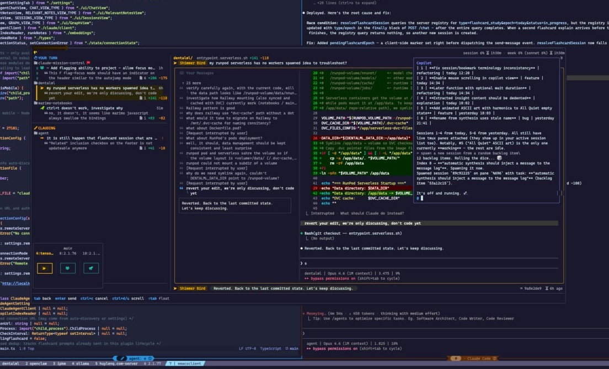
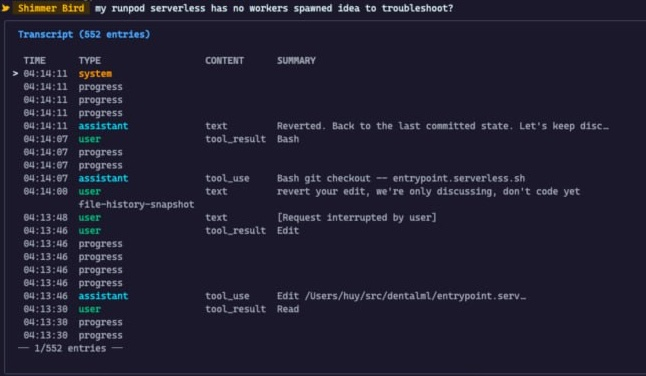
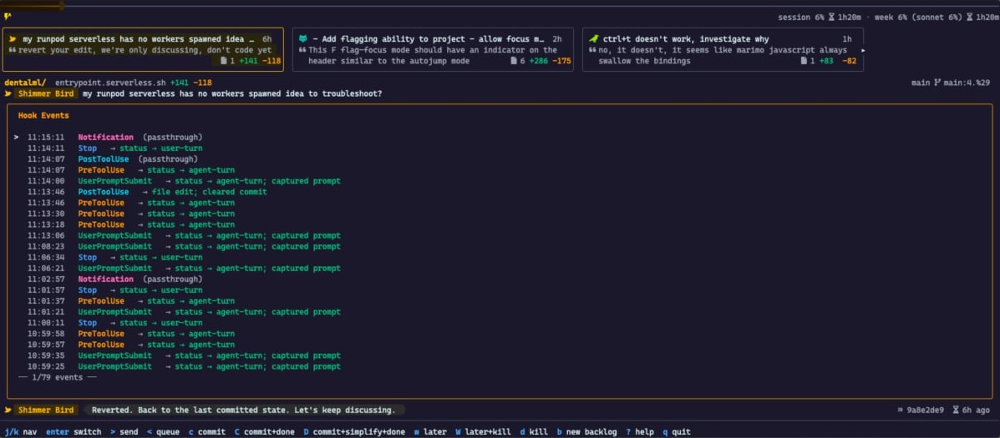
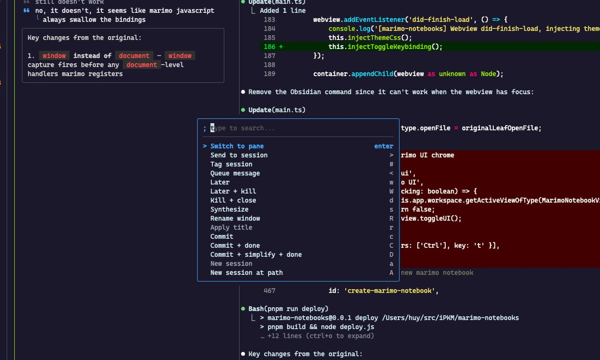
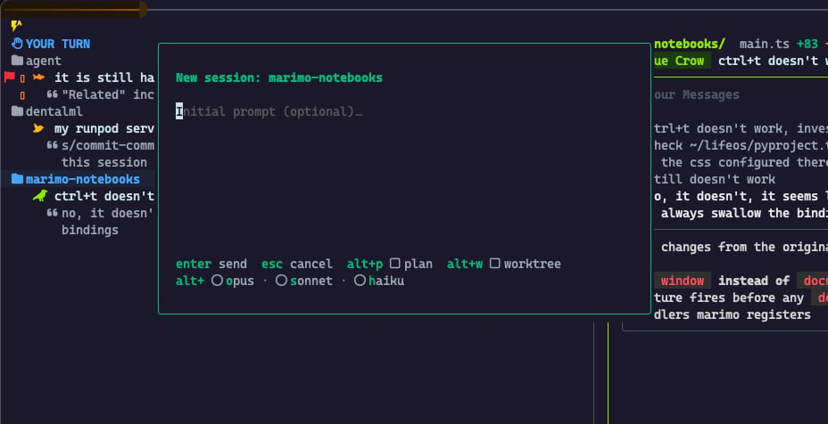
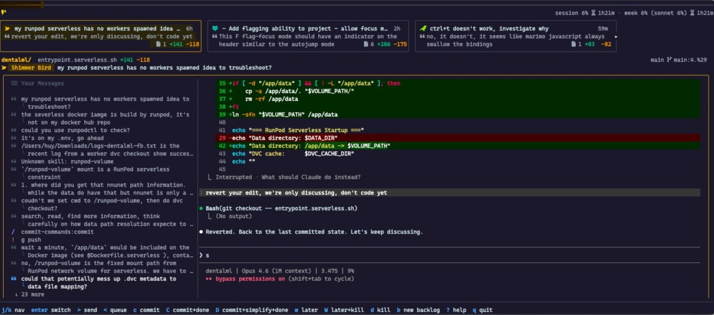
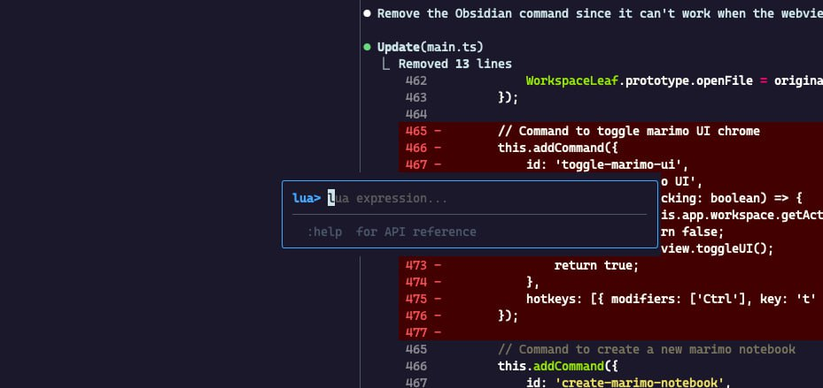

# Spirit

A TUI for monitoring and orchestrating Claude Code sessions across tmux panes.


Works as a tmux popup overlay too — one keystroke to summon, one to dismiss:



## Features

### Live session monitoring

Session sidebar with AI-generated titles, status indicators, git diff stats, and last message preview. The detail panel shows the running conversation with syntax-highlighted diffs.

### Transcript & hook event views

Drill into the raw transcript — every tool call, text response, and progress event timestamped and browsable:



Or inspect the hook event stream for debugging:



### Command palette

Fuzzy-searchable command palette for all actions — switch panes, send messages, queue prompts, spawn sessions, synthesize, and more:



### Spawn new sessions

Launch new Claude Code sessions directly from Spirit with an initial prompt, model selection (Opus / Sonnet / Haiku), and plan or worktree mode toggles:



### Queue & relay messages

Queue up prompts to send to sessions. Manage multiple sessions without context-switching out of Spirit:



### Lua scripting

Built-in Lua REPL for automating and extending Spirit on the fly — full API access to sessions, lifecycle, and orchestration:



### And more

- **Tmux minimap** — visual overview of your tmux window layout with pane status
- **Autojump** — let the spirits carry you to where you should attend
- **Mark for later** — snooze a session with a countdown timer
- **Vim navigation** — `j`/`k` to browse, `Enter` to switch, `/` to filter
- **Meta-synthesis** — AI-generated session names and cross-session insights

## Install

### With TPM

```bash
set -g @plugin 'huylenq/spirit'
```

### Manual

```bash
git clone https://github.com/huylenq/spirit ~/.tmux/plugins/spirit
cd ~/.tmux/plugins/spirit && make build
```

Then add to `~/.tmux.conf`:
```bash
run-shell ~/.tmux/plugins/spirit/spirit.tmux
```

## Setup

### Claude Code hooks

Run once after install:

```bash
~/.tmux/plugins/spirit/bin/spirit setup
```

This auto-patches `~/.claude/settings.json` with the required hooks. Re-run after updates to migrate hook paths if needed.

## Keybindings

The tmux plugin (`spirit.tmux`) binds:

| Key | Mode | Action |
|-----|------|--------|
| `prefix` + `Ctrl-Space` | prefix | Fullscreen popup |
| `Ctrl-Tab` | root (no prefix) | Normal popup |

### Inside the TUI

| Key | Action |
|-----|--------|
| `j` / `k` | Navigate sessions |
| `Enter` | Switch to selected pane |
| `/` | Filter sessions |
| `d` | Defer session (set timer) |
| `u` | Undefer session |
| `s` | Synthesize session (AI) |
| `S` | Synthesize all sessions |
| `m` | Toggle minimap |
| `g` | Toggle group by project |
| `h` | Toggle hook event debug view |
| `r` | Rename tmux window (AI) |
| `x` | Kill session |
| `H` / `L` | Shrink/grow list panel |
| `Ctrl-d` / `Ctrl-u` | Scroll preview |
| `n` / `N` | Next/prev user message |
| `f` | Toggle fullscreen/normal popup |
| `q` / `Esc` | Quit |

## How it works

The plugin uses [Claude Code hooks](https://docs.anthropic.com/en/docs/claude-code/hooks) to track status:

- `PreToolUse` — sets status to "agent-turn" when Claude runs tools
- `UserPromptSubmit` — sets status to "agent-turn" and captures the user's prompt
- `Stop` — sets status to "user-turn" when Claude finishes

Status files are stored in `~/.cache/spirit/`. A background daemon polls tmux panes every second and pushes updates to connected TUI clients over a Unix socket.

## License

MIT
