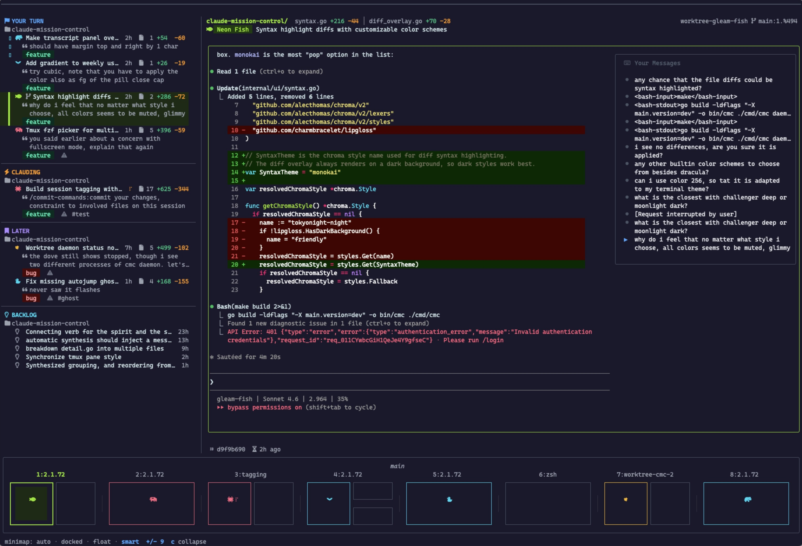
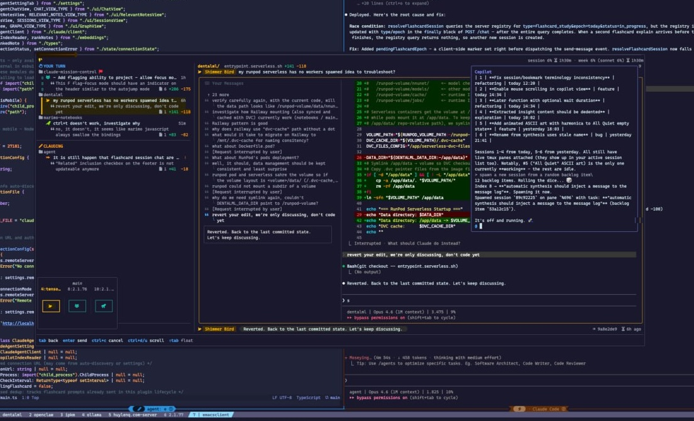
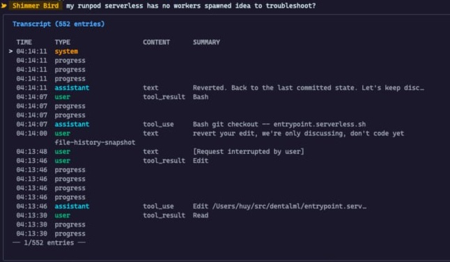
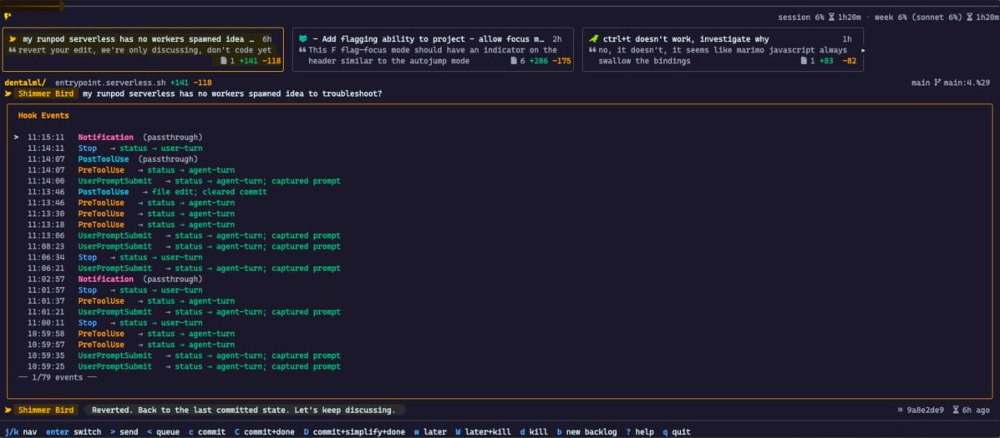
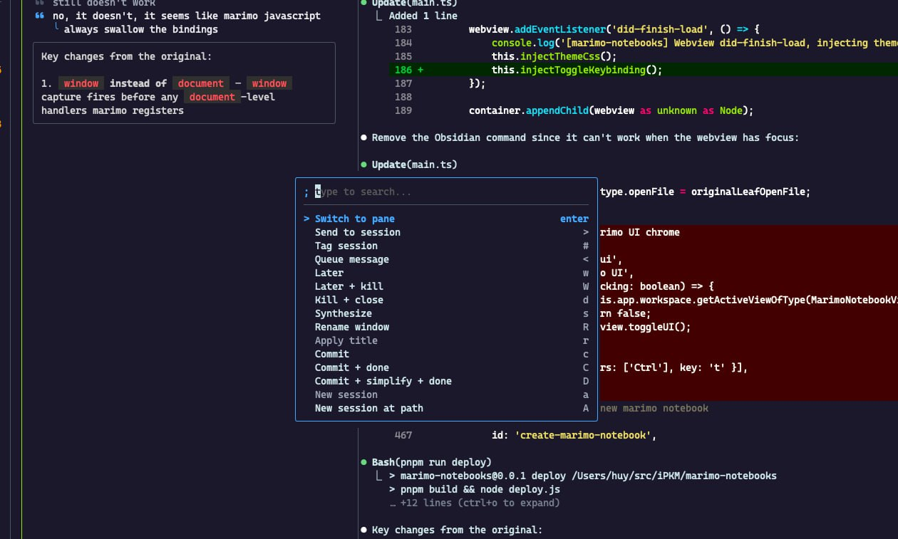
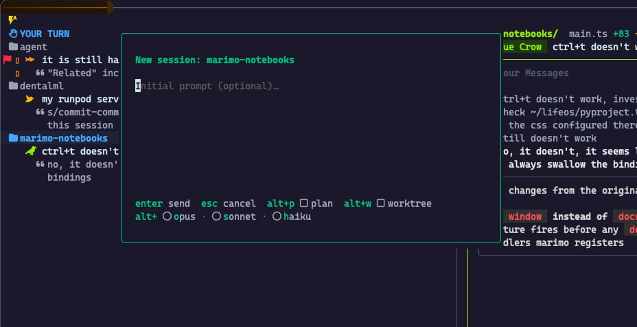
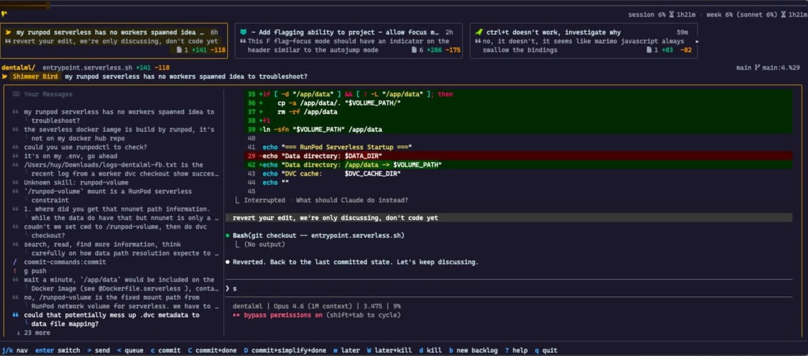
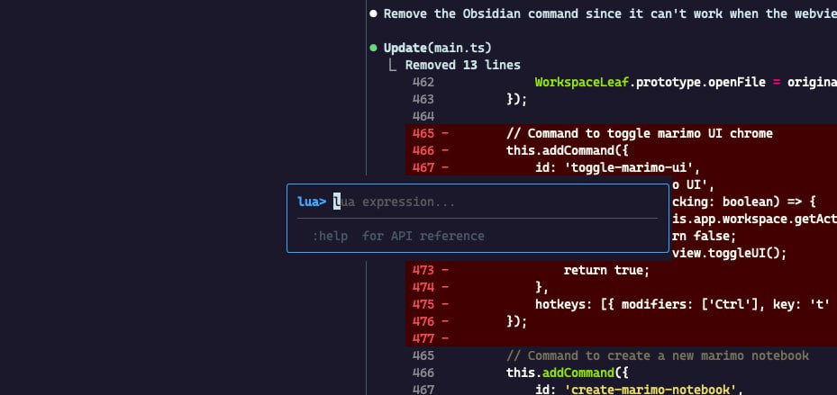

# Spirit

A TUI for monitoring Claude Code and Codex CLI sessions in parallel without losing track of any of them.

You spawn agents across tmux panes — one per task, one per worktree, one per stray idea. Spirit watches them all, tells you which ones are waiting on you, and lets you send work, switch, rename, or kill from a single keystroke.



Lives as a tmux popup — one keystroke to summon, one to dismiss:



## What it does

**Sidebar of live sessions.** AI-generated titles, status (agent-turn vs your-turn), git diff stats, last message preview, account usage bar along the top border. The detail panel shows the running conversation with syntax-highlighted diffs.

**Transcript & hook views.** Drill into the raw transcript — every tool call, text response, and progress event timestamped and browsable. Or inspect the hook event stream when something's misbehaving.




**Command palette.** Fuzzy-searchable, covers every action — switch pane, send a message, queue a prompt, spawn a session, synthesize, rename window.



**Spawn sessions in-place.** Pick a model (Opus / Sonnet / Haiku), toggle plan mode or worktree, drop in an initial prompt, go.



**Queue & relay.** Stack up prompts to send when a session frees up. Manage a fleet without context-switching out.



**Backlog.** Persistent per-project task list. Append from any session, tag with `#hashtags`, expand into a full pane when you want to triage.

_TODO screenshot: docs/screenshots/backlog.jpg_

**Flags & focus mode.** Flag the sessions you actually care about (`alt+f`), jump between flagged ones (`f`), or collapse the sidebar to show only those (`F`).

_TODO screenshot: docs/screenshots/focus-mode.jpg_

**Work-queue view** (`v`). Alternative layout — a horizontal strip of recent messages on top, full-width detail below. Good when you're driving one session and only ambiently watching the others.

_TODO screenshot: docs/screenshots/work-queue-view.jpg_

**Tmux minimap.** Visual overview of your tmux window layout with per-pane status colored in.

_TODO screenshot: docs/screenshots/minimap.jpg_

**Lua REPL.** Full scripting access to sessions, lifecycle, and orchestration for when you want to automate something gnarly.



Plus: per-session notes (`n`), recorded macros (`.`), autojump to whoever needs you next, snooze-with-timer (`w`), project filter + MRU cycling (`p`, `alt+n`/`alt+p`), vim navigation, meta-synthesis (AI-generated session names and cross-session insights), and an `spirit dev` fzf worktree picker.

## Install

With TPM:

```bash
set -g @plugin 'huylenq/spirit'
```

Or manually:

```bash
git clone https://github.com/huylenq/spirit ~/.tmux/plugins/spirit
cd ~/.tmux/plugins/spirit && make build
```

Then add to `~/.tmux.conf`:

```bash
run-shell ~/.tmux/plugins/spirit/spirit.tmux
```

Wire up Claude Code and Codex hooks (once after install, and after updates):

```bash
~/.tmux/plugins/spirit/bin/spirit setup
```

This auto-patches `~/.claude/settings.json` and `~/.codex/hooks.json` with the hooks Spirit needs to track session status. Existing unrelated hooks are preserved.

## Keybindings

Tmux-level (`spirit.tmux` binds these):

| Key | Mode | Action |
|-----|------|--------|
| `prefix` + `Ctrl-Space` | prefix | Fullscreen popup |
| `Ctrl-Tab` | root | Normal popup |

Inside the TUI:

| Key | Action |
|-----|--------|
| `j` / `k` | Navigate sessions |
| `Enter` | Switch to selected pane |
| `/` | Search · `p` Filter by project · `;` Command palette |
| `Tab` / `Shift-Tab` | Open Lulu / toggle Lulu · `alt+'` switch mode |
| `Ctrl-j` / `Ctrl-k` | Next/prev message in detail |
| `Ctrl-d` / `Ctrl-u` | Half-page scroll preview |
| `s` / `S` | Synthesize one / all sessions (AI) |
| `r` / `R` | Rename window / rename all windows (AI) |
| `w` / `W` / `alt+w` | Later (snooze) / later+kill / toggle later view |
| `d` | Kill session |
| `n` | Edit note · `.` Macros · `alt+b` Backlog |
| `alt+f` / `f` / `F` | Flag / next flagged / focus mode |
| `m` / `M` / `o` | Minimap / minimap mode / group by project |
| `v` | Alt work-queue view |
| `alt+h` / `alt+l` | Shrink / grow list panel |
| `z` | Fullscreen ↔ normal popup |
| `q` / `Esc` | Quit |

## How it works

Spirit is a daemon + TUI client. The daemon polls tmux panes every second and pushes updates to connected clients over a Unix socket. Claude Code and Codex hooks feed the same lifecycle:

- `PreToolUse` → "agent-turn" (the coding agent is working)
- `UserPromptSubmit` → "agent-turn" + captures your prompt
- `Stop` → "user-turn" (the coding agent is waiting on you)

Codex v1 supports discovery, status, transcripts, switching, direct relay, kill, notes, tags, and Spirit-local synthesis. A newly started Codex process appears immediately; its session ID and transcript attach after its first trusted hook. Sidebar rows use fixed-width provider glyphs: coral asterisk for Claude and blue atom/knot for OpenAI Codex. Codex spawning/resume, queue/Later, models, approvals, usage, and worktrees are deferred.

Status files live in `~/.spirit/`. The daemon auto-shuts down after 10 minutes with no clients.

## License

MIT
