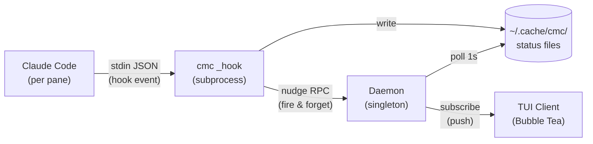
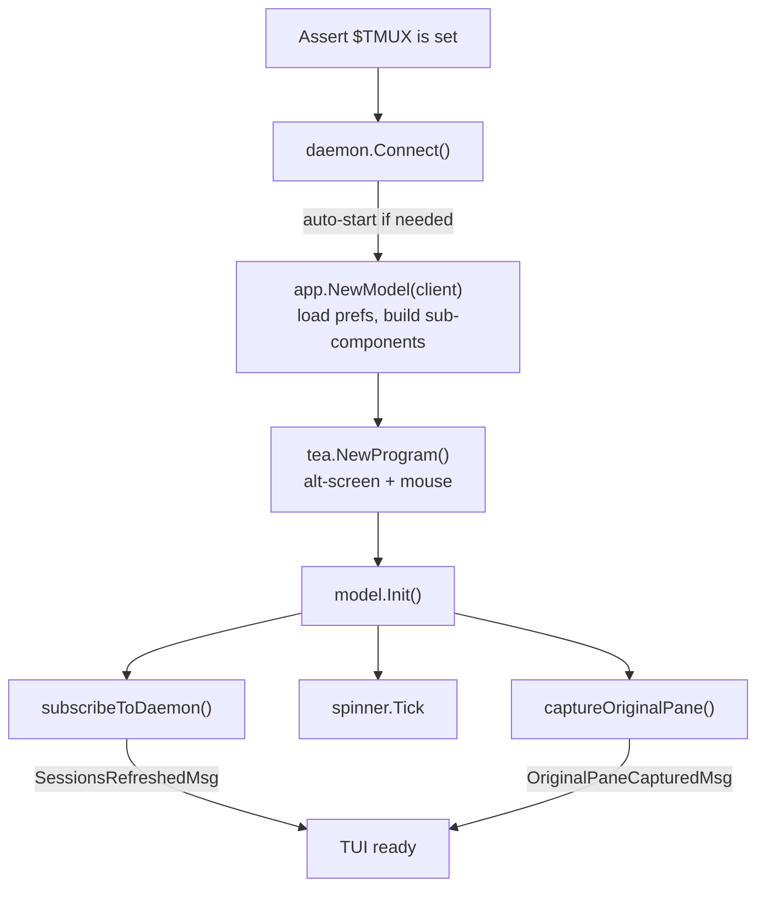
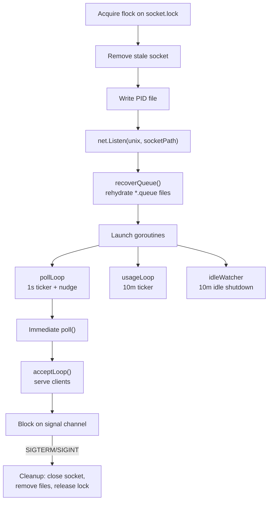
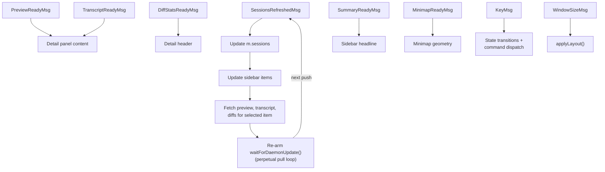
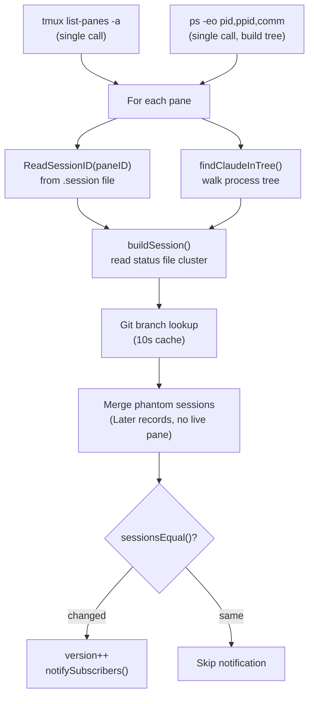
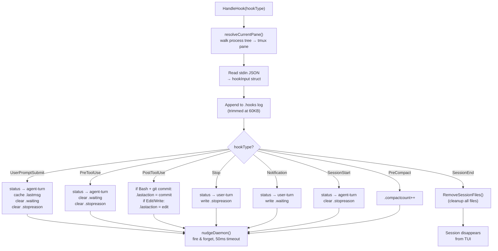
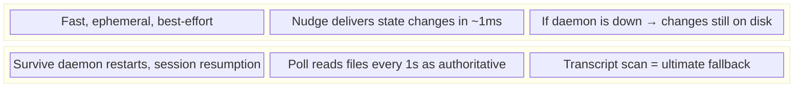
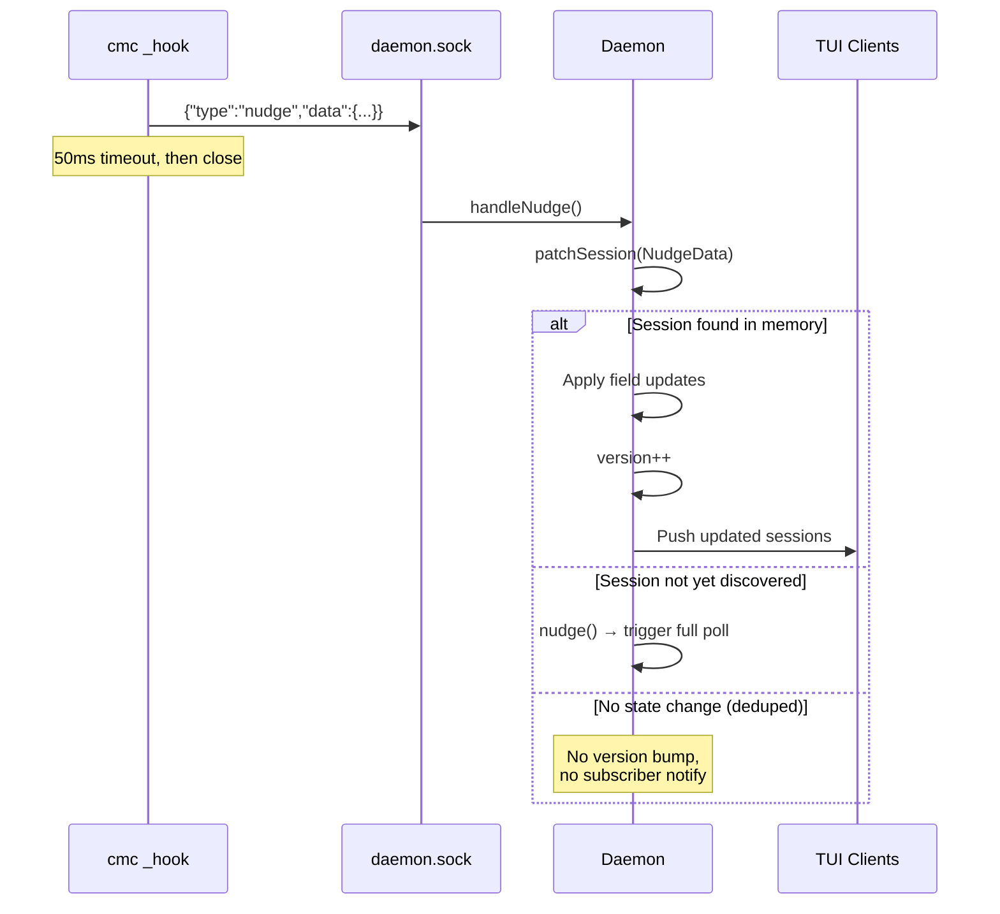
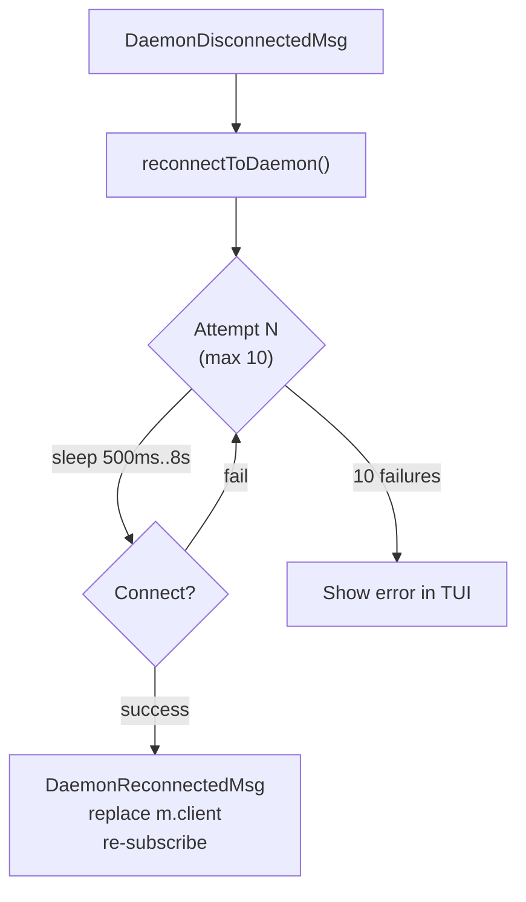
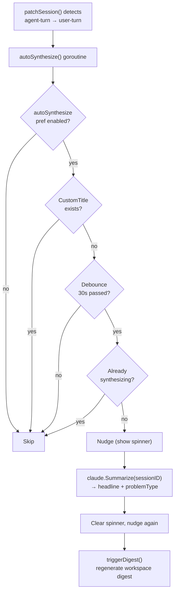

# Runtime Architecture

How claude-mission-control starts, processes events, discovers sessions, and renders UI.

## System Overview



Three processes collaborate:
1. **Daemon** — long-lived singleton that polls sessions and serves clients
2. **TUI Client** — Bubble Tea terminal UI connecting to the daemon
3. **Hook Handler** — short-lived `cmc _hook <type>` subprocess invoked by Claude Code

## Startup Flow

### Entrypoint

`cmd/cmc/main.go` dispatches on `os.Args[1]`:

| Subcommand | Action |
|-----------|--------|
| (none) | TUI client mode |
| `daemon` | Start daemon process |
| `_hook <type>` | Handle a Claude Code hook event |
| `setup` | Register hooks in `~/.claude/settings.json` |
| `capture [WxH]` | Headless render for debugging |
| `eval [script]` | Run Lua script via daemon RPC |
| `orchestrator` | Register/unregister orchestrator sessions |

### TUI Client Startup



1. Assert `$TMUX` is set (TUI requires tmux)
2. `daemon.Connect()` — dials the daemon Unix socket twice (subscribe + RPC), auto-starting the daemon as a detached subprocess if the socket isn't live
3. `app.NewModel(client)` — loads persisted preferences, builds all sub-components
4. `tea.NewProgram()` starts with alt-screen and mouse support
5. `model.Init()` fires three parallel commands:
   - `subscribeToDaemon()` — sends subscribe request, returns initial session snapshot as `SessionsRefreshedMsg`
   - `m.spinner.Tick` — starts the loading spinner
   - `captureOriginalPane()` — captures the current tmux pane for restoration on quit

### Daemon Startup



`Run()` in `internal/daemon/daemon.go`:

1. Acquire exclusive `flock` on `<socket>.lock` (prevents duplicate daemons)
2. Remove stale socket from previous crash
3. Write PID file
4. `net.Listen("unix", socketPath)`
5. `recoverQueue()` — rehydrate queued messages from `*.queue` files on disk
6. Launch goroutines:
   - `pollLoop` — 1-second ticker + nudge channel
   - `usageLoop` — 10-minute ticker for API usage stats
   - `idleWatcher` — auto-shutdown after 10 minutes with zero clients
7. One immediate `poll()` before `acceptLoop()` starts accepting clients
8. Block on signal channel; clean up on SIGTERM/SIGINT

## Bubble Tea Architecture

### Model

`internal/app/model.go` — large flat struct holding all UI state.

Key fields:
```go
client            *daemon.Client        // connection to daemon
sidebar           ui.SidebarModel       // left panel
detail            ui.DetailModel        // right panel
sessions          []claude.ClaudeSession // latest snapshot from daemon
state             AppState              // current interaction mode (14 states)
```

Sub-models: `search`, `relay`, `queueRelay`, `tagRelay`, `minimap`, `usageBar`, `palette`, `prefsEditor`, `promptEditor`, `macroEditor`.

### Update Loop

The Update function spans multiple files (`update.go`, `memo_update.go`, `macro_update.go`) dispatching on `AppState` and message type.

Core event flow:



### View Composition

`internal/app/view.go` renders the frame in this order:

1. Top border (usage bar)
2. Label line (usage stats or search input)
3. Content area:
   - Sidebar panel (left) + Detail panel (right) joined horizontally
   - Queue section appended below detail when items pending
4. Docked minimap (if applicable, reduces content height)
5. Overlays composited on top: minimap float, debug, spirit animal, help, message log/toast, macro palette, command palette, preferences, prompt editor
6. Footer (keybinding hints, flash messages, or chord hints)
7. Side borders and bottom border (when not fullscreen)

## Session Discovery

### Discovery Cycle

`claude.DiscoverSessions()` runs every second in the daemon's `pollLoop`. Source: `internal/claude/discover.go`.



1. **Pane enumeration**: Single `tmux list-panes -a -F <format>` call returns all panes across all tmux sessions
2. **Process tree**: Single `ps -eo pid,ppid,comm` call builds a PPID→children map
3. **Session matching**: For each pane:
   - `ReadSessionID(paneID)` reads `~/.cache/cmc/<paneID>.session` (written by hooks)
   - `findClaudeInTree()` walks the process tree under the pane's shell PID looking for a `claude` process
4. **State assembly**: `buildSession()` reads the cluster of per-session status files (`ReadStatus`, `ReadLastUserMessage`, `ReadCachedSummary`, `ReadCustomTitle`, `ReadStopReason`, `ReadSkillName`, etc.)
5. **Git branch**: Looked up with a 10-second in-process cache
6. **Phantom sessions**: "Later" later-marked sessions with no live pane are merged in at the end (`IsPhantom: true`)
7. **Change detection**: `sessionsEqual()` compares 20+ fields; if different, daemon bumps `version` and calls `notifySubscribers()`

### ClaudeSession

`internal/claude/session.go` — the central data type.

**Status** is a two-value enum:
- `StatusAgentTurn` — Claude is working (spinner shown)
- `StatusUserTurn` — Claude stopped, waiting for user (age shown)

`ParseStatus()` accepts legacy values (`"working"`, `"stopped"`, `"done"`, `"later"`, `"idle"`, `"deferred"`) and maps them to the two-value enum.

**Display name priority**: `CustomTitle → Headline → FirstMessage → "(New session)"`

## Hook System

### Registration

`cmc setup` patches `~/.claude/settings.json` to call `cmc _hook <HookType>` for 8 event types:

| Hook Type | Matcher | Purpose |
|-----------|---------|---------|
| `PreToolUse` | (all) | Mark agent-turn, clear waiting |
| `PostToolUse` | Bash, Edit, Write | Detect git commits and file edits |
| `UserPromptSubmit` | (all) | Mark agent-turn, cache last message |
| `Stop` | (all) | Mark user-turn, capture stop reason |
| `Notification` | (all) | Mark waiting (permission/elicitation) |
| `SessionStart` | (all) | Initialize session state |
| `SessionEnd` | (all) | Clean up all session files |
| `PreCompact` | (all) | Increment compact counter |

Each hook command embeds a `#cmc-hook` marker for migration/deduplication.

### Hook Handler Flow

`HandleHook(hookType)` in `internal/claude/hook.go`:



### Dual-Layer Design



| Path | Latency | Reliability |
|------|---------|-------------|
| **Nudge** (fast path) | ~1ms | Best-effort; dropped if daemon is down |
| **Poll** (slow path) | up to 1s | Authoritative; reads status files from disk |

### Nudge Fast Path



When the hook subprocess calls `nudgeDaemon()`:

1. Opens a fresh socket connection with 50ms timeout
2. Sends `{type: "nudge", data: NudgeData}` JSON
3. Daemon receives in `handleNudge()` → calls `patchSession()`
4. `patchSession()` finds the session by SessionID (primary) with PaneID fallback
5. Applies field-level updates to the in-memory session
6. If state changed: increments `version`, pushes to all subscribers
7. TUI receives the update within ~50ms — much faster than the 1s poll cycle

If the session isn't tracked yet (new session, not yet discovered), `patchSession()` returns `patchNotFound` and triggers a full `poll()` instead.

Deduplication: if the nudge carries no new information (all fields match), returns `patchDeduped` — no version bump, no subscriber notification.

## tmux Integration

All tmux interaction lives in `internal/tmux/api.go`. Every call is a synchronous `exec.Command("tmux", ...)` subprocess.

| Function | tmux Command | Purpose |
|----------|-------------|---------|
| `ListAllPanes()` | `list-panes -a -F <format>` | Enumerate all panes for discovery |
| `ListPaneGeometry(session)` | `list-panes -s -t <session>` | Extended geometry for minimap |
| `CapturePaneContent(paneID)` | `capture-pane -pJe -S - -t <id>` | Full scrollback for detail preview |
| `SendKeysLiteral(paneID, text)` | `send-keys -l -t <id> text Enter` | Relay text to Claude session |
| `SendKeys(paneID, keys...)` | `send-keys -t <id> key...` | Raw key sequences (bang mode, rename) |
| `SwitchToPaneQuiet()` | `select-window + select-pane + switch-client` | Sync user's view with selection |
| `GetClientSession()` | `display-message -p` | Capture originating pane at startup |
| `NewWindow(session, cwd)` | `new-window -t <session> -c <cwd>` | Create window for new session |
| `KillPane(paneID)` | `kill-pane -t <id>` | Terminate a pane |
| `RenameWindow(session, idx, name)` | `rename-window + set-option` | Set window name, disable auto-rename |

## Message Types

All `tea.Msg` types defined in `internal/app/messages.go`:

### Data Messages (from daemon/tmux)
| Message | Trigger |
|---------|---------|
| `SessionsRefreshedMsg` | Initial subscribe or subsequent daemon push |
| `PreviewReadyMsg` | `capturePreview()` — tmux capture-pane on selection change |
| `TranscriptReadyMsg` | `fetchTranscript()` — daemon RPC on selection change |
| `RawTranscriptReadyMsg` | `fetchRawTranscript()` — when raw transcript overlay is open |
| `HooksReadyMsg` | `fetchHooks()` — when hooks debug overlay is open |
| `DiffStatsReadyMsg` | `fetchDiffStats()` — on selection change or session refresh |
| `DiffHunksReadyMsg` | `fetchDiffHunks()` — when diff overlay is open |
| `SummaryReadyMsg` | `fetchCachedSummary()` (passive) or `fetchSynthesize()` (user-triggered) |
| `SynthesizeAllReadyMsg` | `fetchSynthesizeAll()` — batch synthesis |
| `GlobalEffectsReadyMsg` | `fetchGlobalEffects()` — when debug mode is active |
| `MinimapReadyMsg` | `fetchMinimapData()` — pane geometry for minimap |
| `BacklogsRefreshedMsg` | `discoverBacklogs()` — scans `.cmc/backlog/` directories |

### Lifecycle Messages
| Message | Trigger |
|---------|---------|
| `OriginalPaneCapturedMsg` | `captureOriginalPane()` at startup |
| `DaemonDisconnectedMsg` | Socket error on subscribe or RPC |
| `DaemonReconnectedMsg` | Successful reconnect after backoff |
| `PaneKilledMsg` | After SIGTERM + kill-pane |
| `NewSessionCreatedMsg` | After spawning new tmux window |
| `WindowRenameMsg` | Haiku window naming completion |

### UI Messages
| Message | Trigger |
|---------|---------|
| `ClearFlashMsg` | TTL expiry for footer flash |
| `ClearToastMsg` | TTL expiry for toast notification |
| `MacroEditorExitedMsg` | External `$EDITOR` process exit |
| `LuaEvalDoneMsg` | Async Lua script evaluation completion |

## Reconnection



On `DaemonDisconnectedMsg`, the model runs `reconnectToDaemon()`:

- Exponential backoff: 500ms → 1s → 2s → 4s → 8s (capped), 10 attempts
- On success: `DaemonReconnectedMsg` replaces `m.client` and re-subscribes
- On failure: shows error in TUI
- Daemon auto-starts on `Connect()` if the socket isn't live

## Auto-Synthesis



When a session transitions from agent-turn → user-turn, the daemon automatically generates an AI summary:

1. `patchSession()` detects the transition → calls `autoSynthesize()` in a goroutine
2. Checks: `autoSynthesize` pref enabled (default on), no custom title (would take priority anyway), 30-second debounce per session, no in-flight synthesis
3. Nudges daemon to show spinner immediately
4. Calls `claude.Summarize(sessionID)` — generates headline + problem type
5. On completion: clears spinner, nudges again to propagate new headline
6. Triggers `triggerDigest()` to regenerate workspace digest

Also runs on `SessionEnd` (so sessions get a final summary even after the pane closes).
