# Hook System & Session Lifecycle

## Architecture Overview

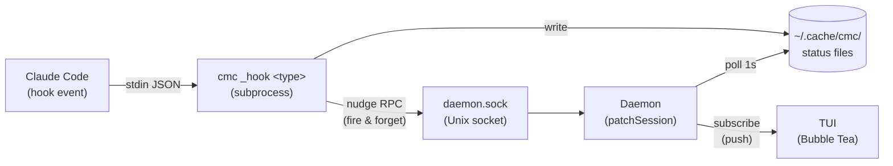

The daemon has **two paths** to learn about state changes:

| Path | Latency | Reliability |
|------|---------|-------------|
| **Nudge** (fast path) | ~1ms | Best-effort; dropped if daemon is down |
| **Poll** (slow path) | up to 1s | Authoritative; reads status files from disk |

## Hook Registration

`cmc setup` writes hook commands into `~/.claude/settings.json`:

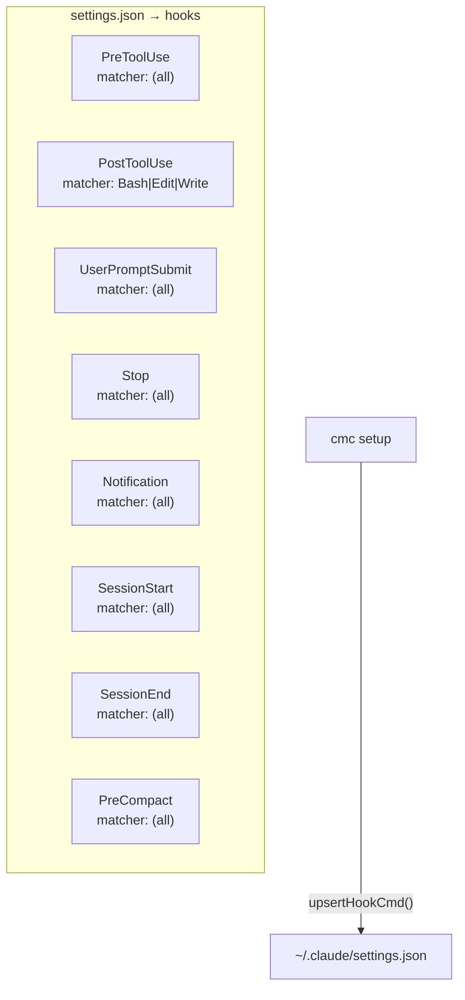

Each hook command embeds `#cmc-hook` marker for future migration/deduplication.

## Session Lifecycle

### Current (incorrect semantics)

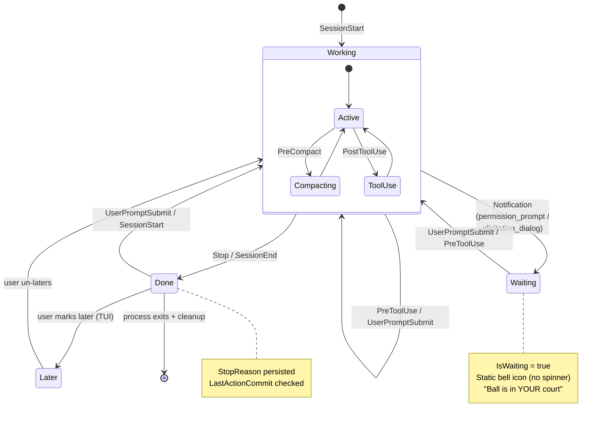

**Problems with current model:**
- `"stopped"` / `StatusDone` conflates two different things: "user needs to act" (Stop) and "session is dead" (SessionEnd)
- `Later` is treated as a runtime status (`StatusLater`) but it's really a UI grouping tag orthogonal to runtime state
- `SessionEnd → stopped` is wrong: user has nothing to do when a session ends

### New (correct semantics)

Two runtime statuses based on **whose turn it is**:

| Status value | Const | Meaning | Who acts next? |
|-------------|-------|---------|----------------|
| `agent-turn` | `StatusAgentTurn` | Claude is thinking / executing tools | Claude |
| `user-turn` | `StatusUserTurn` | Claude stopped, waiting for user decision | User |

A session is **gone** (no status file / cleaned up) when the process exits. `SessionEnd` does not set a status — it triggers cleanup.

`Later` is a **tag** (record), not a status. A session can be marked later regardless of runtime state. It only affects TUI grouping (Later-marked sessions appear in a separate "Later" group).

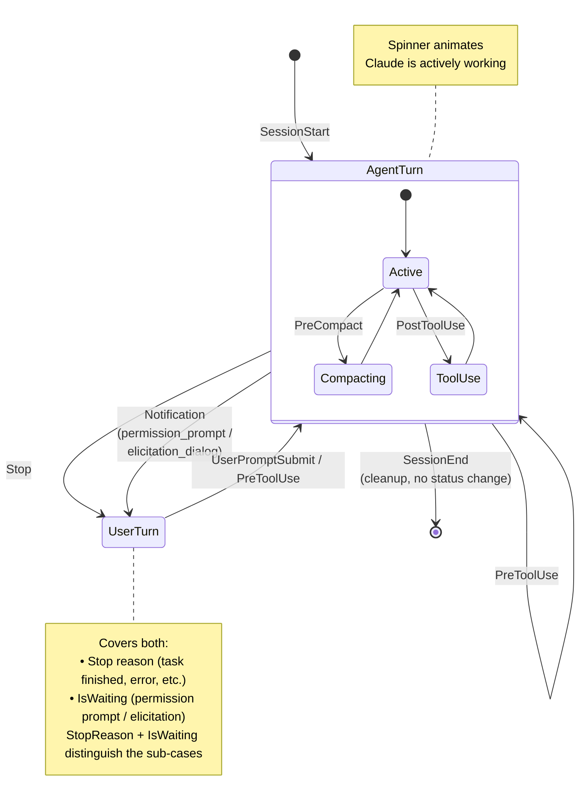

**Key differences from current:**

| Aspect | Current | New |
|--------|---------|-----|
| SessionEnd | → `stopped` (user-turn) | → cleanup/removal (no status) |
| Stop | → `stopped` | → `user-turn` |
| Notification (waiting) | overlay on `working` | → `user-turn` with `IsWaiting=true` |
| Later | `StatusLater` (a 3rd status) | Tag on session, orthogonal to status |
| Status file values | `working` / `stopped` / `later` | `agent-turn` / `user-turn` (no `later`) |
| UserPromptSubmit | → `working` | → `agent-turn` |

**Hook → status mapping (new):**

| Hook | Status change | Rationale |
|------|--------------|-----------|
| SessionStart | → `agent-turn` | Claude starts working |
| UserPromptSubmit | → `agent-turn` | User submitted, now it's Claude's turn |
| PreToolUse | → `agent-turn` | Claude is executing a tool |
| Stop | → `user-turn` | Claude stopped, user decides what's next |
| Notification | → `user-turn` | Claude needs user permission/input |
| PostToolUse | (no change) | Still agent's turn, just logging tool result |
| PreCompact | (no change) | Internal event, no turn change |
| SessionEnd | → **cleanup** | Process is gone, remove status files |

**Notification vs Stop — both `user-turn` but different UX:**

| Sub-case | `IsWaiting` | `StopReason` | TUI rendering |
|----------|-------------|-------------|---------------|
| Permission prompt | `true` | (empty) | Bell icon (magenta) — "approve this" |
| Task finished | `false` | e.g. `"end_turn"` | Age string (gray) — "done, review it" |
| Error | `false` | e.g. `"error"` | Age + reason badge — "something broke" |

### Crash Recovery

When the daemon polls and finds no Claude process but `.status` says `"agent-turn"`:

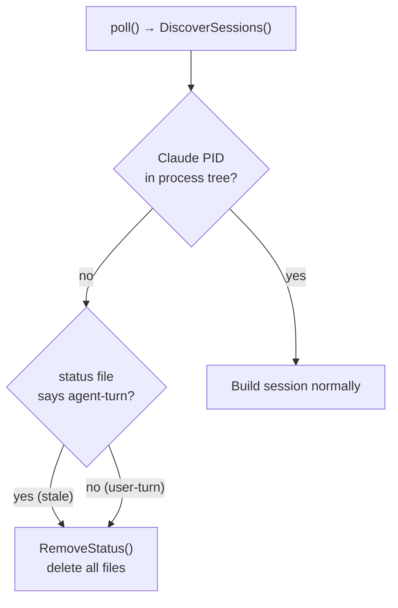

Process gone = session gone. No intermediate "stopped" state for dead sessions — just clean up the files. This is the safety net for when `SessionEnd` hook doesn't fire (crash, SIGKILL, etc.).

## Hook Event Details

### HandleHook Switch

#### Current

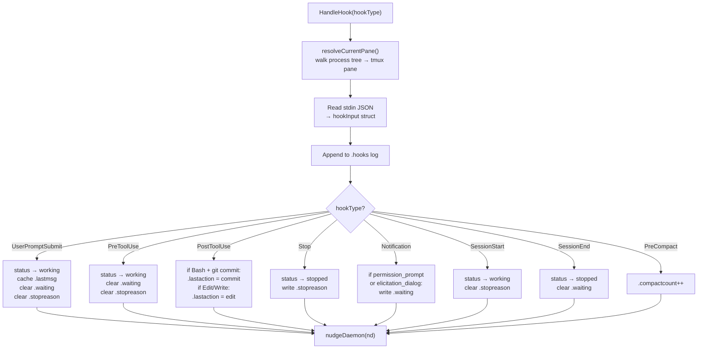

#### New

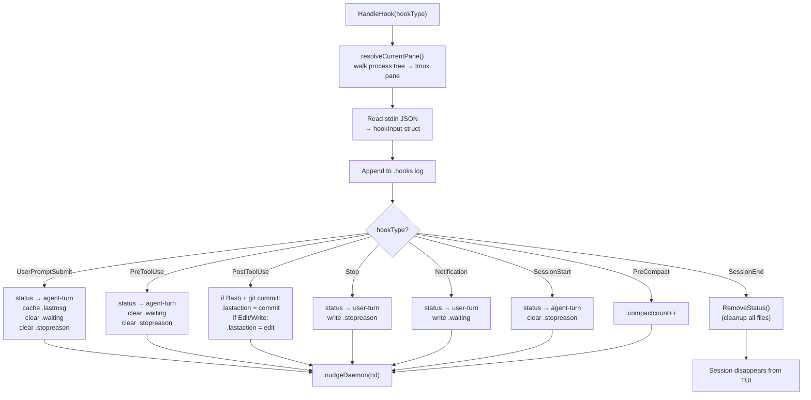

### What Each Hook Carries

#### Current

| Hook | Status Change | Key Fields Used | Nudge Fields Set |
|------|--------------|-----------------|------------------|
| UserPromptSubmit | → working | `prompt` | `Status`, `LastUserMessage`, `IsWaiting=false` |
| PreToolUse | → working | (none) | `Status`, `IsWaiting=false` |
| PostToolUse | (none) | `tool_name`, `tool_input` | `IsGitCommit` or `IsFileEdit` |
| Stop | → stopped | `reason` | `Status`, `StopReason` |
| Notification | (none) | `notification_type` | `IsWaiting=true` |
| SessionStart | → working | (none) | `Status` |
| SessionEnd | → stopped | (none) | `Status` |
| PreCompact | (none) | (none) | `Compacted=true` |

#### New

| Hook | Status Change | Key Fields Used | Nudge Fields Set |
|------|--------------|-----------------|------------------|
| UserPromptSubmit | → `agent-turn` | `prompt` | `Status`, `LastUserMessage`, `IsWaiting=false` |
| PreToolUse | → `agent-turn` | (none) | `Status`, `IsWaiting=false` |
| PostToolUse | (none) | `tool_name`, `tool_input` | `IsGitCommit` or `IsFileEdit` |
| Stop | → `user-turn` | `reason` | `Status`, `StopReason` |
| Notification | → `user-turn` | `notification_type` | `Status`, `IsWaiting=true` |
| SessionStart | → `agent-turn` | (none) | `Status` |
| SessionEnd | → **cleanup** | (none) | `RemoveSession` (session removed) |
| PreCompact | (none) | (none) | `Compacted=true` |

## Nudge Protocol

The hook subprocess sends a fire-and-forget JSON message to the daemon:

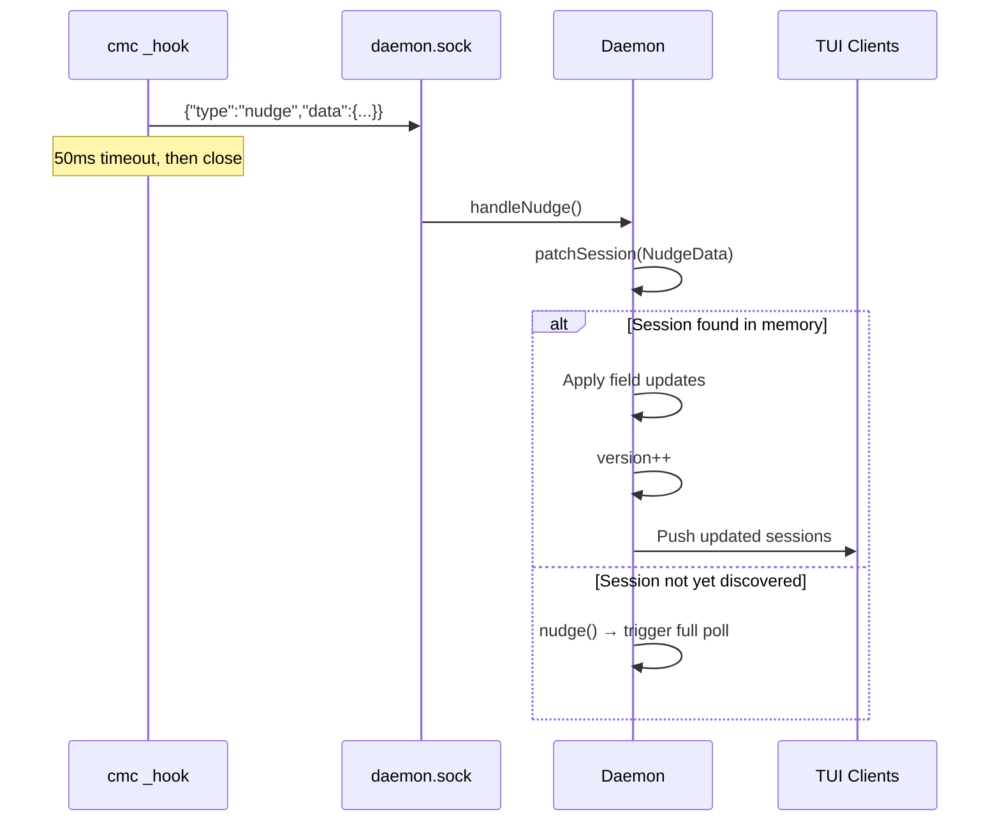

### NudgeData Fields

#### Current

```
PaneID          string   ← which pane changed
Status          string   ← "agent-turn" or "user-turn" (empty = no status change)
LastUserMessage string   ← cached user prompt
StopReason      string   ← why session stopped
IsWaiting       *bool    ← nil=no change, true=waiting, false=not waiting
IsGitCommit     *bool    ← nil=no change, true=last action was git commit
IsFileEdit      *bool    ← nil=no change, true=last action was file edit
Compacted       bool     ← true=increment compact counter
```

#### New

```
PaneID          string   ← which pane changed
Status          string   ← "agent-turn" or "user-turn" (empty = no status change)
Remove          bool     ← true = session ended, remove from memory
LastUserMessage string   ← cached user prompt
StopReason      string   ← why it's user's turn (only meaningful when user-turn)
IsWaiting       *bool    ← nil=no change, true=permission/elicitation prompt
IsGitCommit     *bool    ← nil=no change, true=last action was git commit
IsFileEdit      *bool    ← nil=no change, true=last action was file edit
Compacted       bool     ← true=increment compact counter
```

`*bool` pointers distinguish "not set" (nil) from "explicitly set to false".

### Daemon patchSession Logic

#### Current

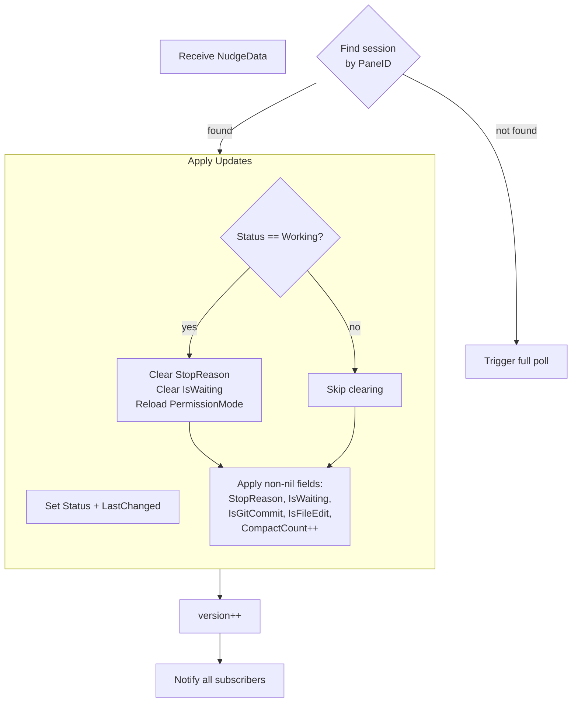

#### New

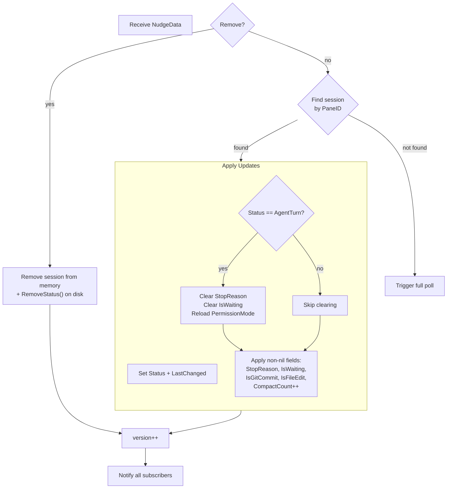

## Status Files

All stored in `~/.cache/cmc/`, keyed by tmux pane ID (e.g., `%1`).

#### Current

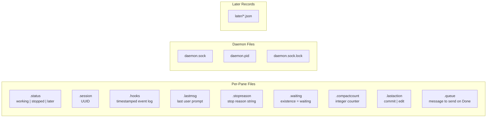

#### New

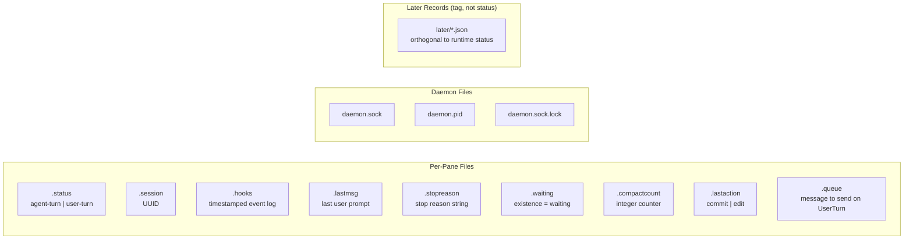

**Key change:** `.status` no longer contains `"later"`. Later records are tracked independently in `later/*.json`. A session can be marked later while in any runtime state.

### File Lifecycle

| File | Created | Updated | Cleared |
|------|---------|---------|---------|
| `.status` | First hook event | Every status-changing hook | `RemoveStatus()` on cleanup |
| `.session` | First hook event (has session_id) | Never (stable per session) | `RemoveStatus()` |
| `.hooks` | First hook event | Every hook (append) | Trimmed at 60KB; `RemoveStatus()` |
| `.lastmsg` | UserPromptSubmit | UserPromptSubmit | `RemoveStatus()` |
| `.stopreason` | Stop hook | Stop hook | UserPromptSubmit / PreToolUse / SessionStart |
| `.waiting` | Notification hook | Notification hook | UserPromptSubmit / PreToolUse / SessionEnd |
| `.compactcount` | First PreCompact | PreCompact (increment) | `RemoveStatus()` (never reset during session) |
| `.lastaction` | PostToolUse | PostToolUse (overwrite) | `RemoveStatus()` |
| `.queue` | Queue request from TUI | Never | Delivered or session disappears |

## TUI Rendering

### Detail Column (right side of session row)

#### Current

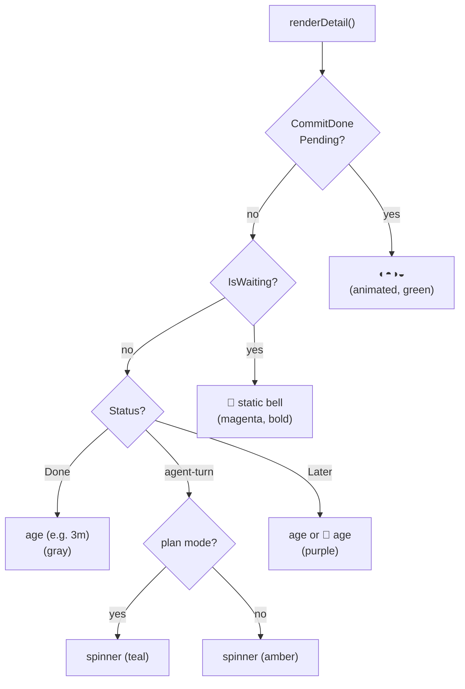

#### New

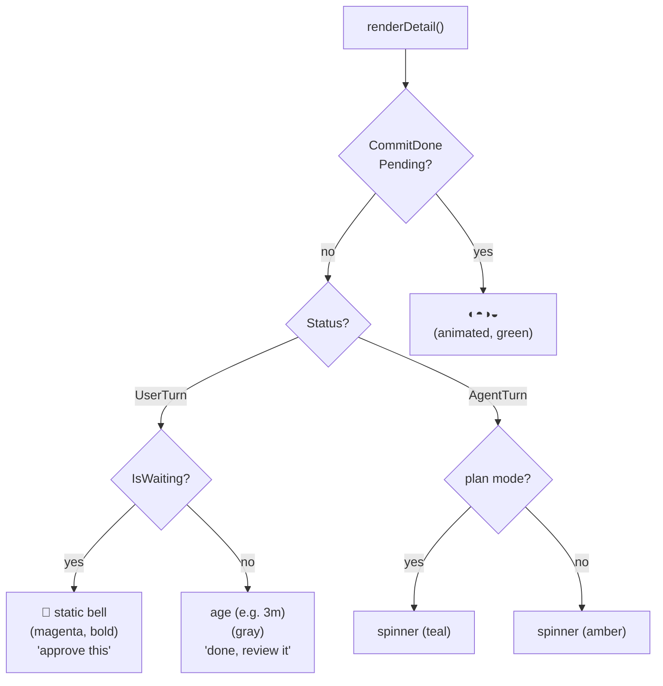

**Note:** `Later` no longer appears here — Later-marked sessions render with their actual runtime status plus a Later record indicator (🔖) in the list grouping, not as a separate status branch.

### Badges Line (below session name)

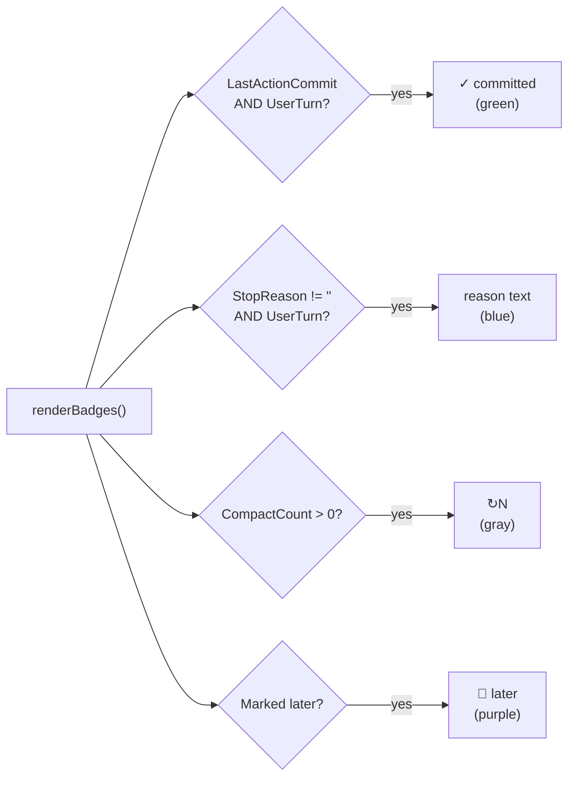

### Hook Event Overlay Colors

In the debug overlay (`hookTypeStyled()`):

| Hook Type | Color | Style Variable |
|-----------|-------|----------------|
| PreToolUse | Amber | `StatWorkingStyle` |
| PostToolUse | Cyan | `StatPostToolStyle` |
| UserPromptSubmit | Green | `DiffAddedStyle` |
| Stop | Blue | `StatDoneStyle` |
| Notification | Magenta | `StatWaitingStyle` |
| SessionStart | Green | `DiffAddedStyle` |
| SessionEnd | Blue | `StatDoneStyle` |
| PreCompact | Purple | `StatLaterStyle` |

## Dual-Layer Design Philosophy

```
┌─────────────────────────────────────────────────┐
│  HOOKS (real-time optimization layer)            │
│  Fast, ephemeral, best-effort                    │
│  Nudge delivers state changes in ~1ms            │
│  If daemon is down → changes still on disk       │
├─────────────────────────────────────────────────┤
│  STATUS FILES + TRANSCRIPT (source of truth)     │
│  Survive daemon restarts, session resumption     │
│  Poll reads files every 1s as authoritative      │
│  Transcript scan = ultimate fallback for commits │
└─────────────────────────────────────────────────┘
```

Hooks are the **fast path** — they get changes to the TUI in milliseconds.
Status files are the **truth** — they survive crashes and daemon restarts.
Transcript scanning is the **last resort** — for sessions started before hooks existed.
