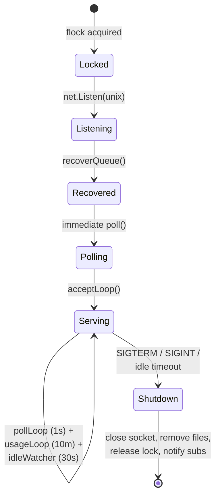
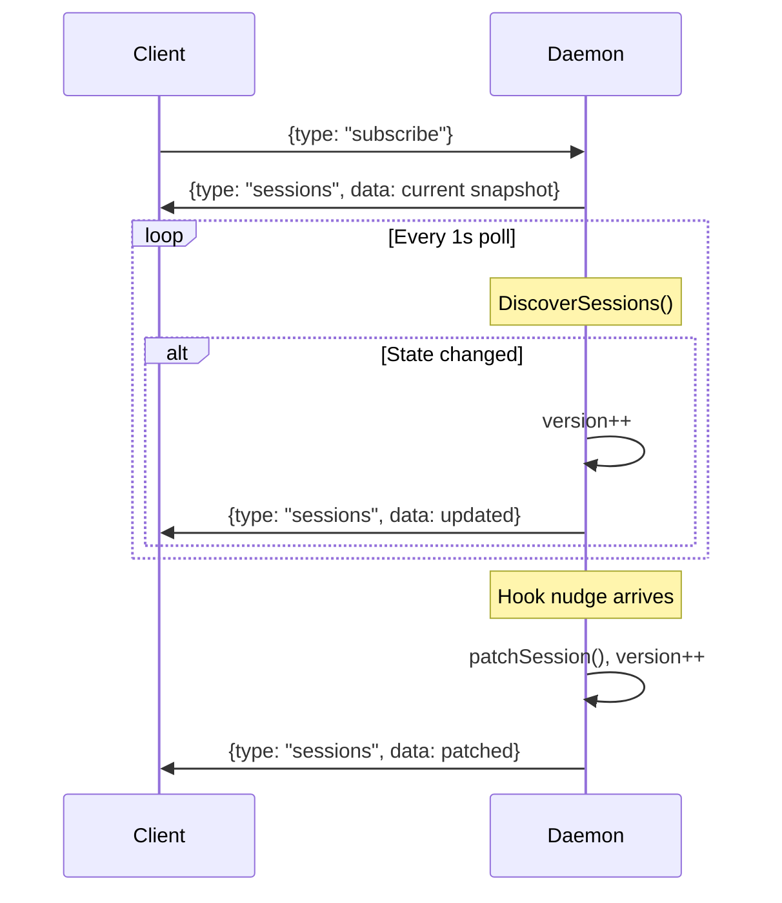
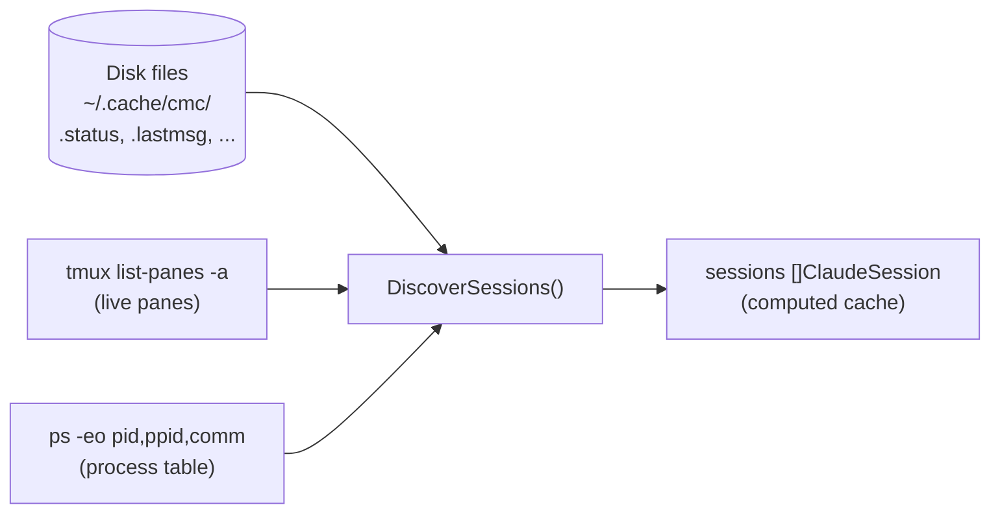
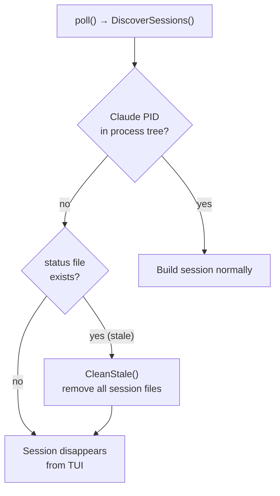
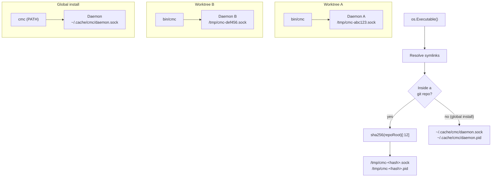
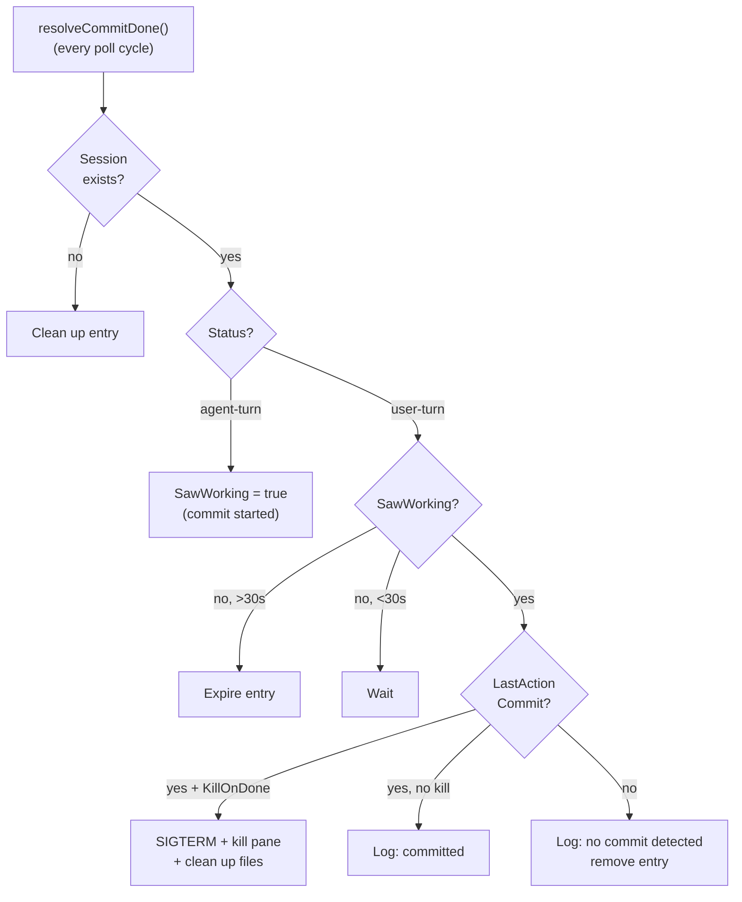
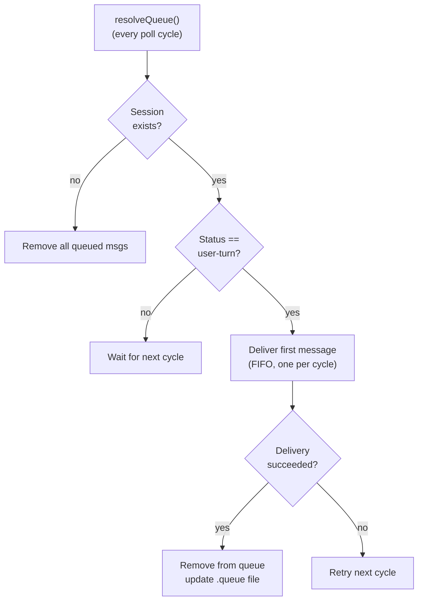
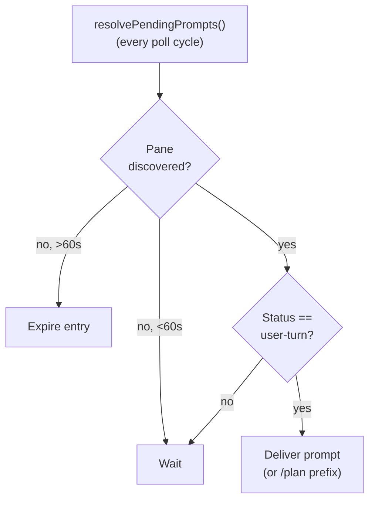

# Persistence & Daemon Memory Model

How claude-mission-control stores state, communicates between processes, and recovers after restarts.

## Daemon Architecture

### Process Model

The daemon is a single long-lived background process started via `cmc daemon` (or auto-started on first client connect).

```go
type Daemon struct {
    sessions          []ClaudeSession      // current session snapshot (rebuilt every poll)
    version           uint64               // monotonic counter, bumped on any change
    subscribers       map[*subscriber]     // active push connections
    commitDonePanes   map[sessionID]entry  // pending commit-and-kill operations
    queuePanes        map[sessionID][]msg  // FIFO message queues (mirrored to disk)
    pendingPromptPanes map[paneID]entry    // prompts for newly spawned sessions
    synthesizingPanes map[paneID]bool      // in-flight synthesis state
    lastAutoSynthTime map[sessionID]time   // debounce timestamps
    overlaps/overlapPanes                  // file-overlap detection
    orchestratorIDs   map[sessionID]bool   // excluded from eval sessions()
    usageStats        *UsageStats          // API usage (fetched periodically)
}
```

### Lifecycle



1. **Lock**: Acquires exclusive `flock` on `<socket>.lock` — guarantees single instance per socket path
2. **Listen**: Opens Unix domain socket
3. **Recover**: Rehydrates queued messages from `*.queue` files
4. **Poll**: Runs one immediate `poll()` before accepting clients
5. **Serve**: `acceptLoop()` handles incoming connections
6. **Shutdown**: On SIGTERM/SIGINT — closes socket, removes socket + PID files, releases lock, notifies subscribers

### Idle Auto-Shutdown

`idleWatcher` checks every 30 seconds. If `clientCount == 0` and last disconnect was > 10 minutes ago, sends SIGTERM to self. The daemon restarts automatically on next `Connect()`.

## IPC Protocol

### Wire Format

Newline-delimited JSON over Unix domain socket. Each message is either:

```json
{"type": "request_type", "data": {...}}      // Request
{"type": "response_type", "data": {...}, "version": 42, "error": ""}  // Response
```

Source: `internal/daemon/protocol.go`

### Dual Connection Model

Each `Client` opens **two connections** to the daemon:

| Connection | Purpose | Pattern |
|------------|---------|---------|
| **Subscribe** (`subConn`) | Persistent push stream | Client sends `subscribe` once, then blocks reading; daemon pushes on every state change |
| **RPC** (`rpcConn`) | Request/response | Serialized with `rpcMu` mutex; one request at a time |

`ConnectRPCOnly()` is available for non-TUI commands (`cmc eval`, `cmc orchestrator`) that don't need the subscribe stream.

### Subscribe Flow



Subscriber channels are non-blocking with drop-stale-update semantics: if the subscriber hasn't consumed the previous push, it's replaced with the latest.

### RPC Commands

28 request types. Source: `internal/daemon/protocol.go`.

#### Session Queries
| Request | Data | Response |
|---------|------|----------|
| `ping` | — | `pong` |
| `subscribe` | — | `sessions` (then continuous push) |
| `sessions` | `{status?}` | `sessions` (filtered by orchestrator exclusion) |
| `transcript` | `{sessionID}` | `{messages: string[]}` |
| `raw_transcript` | `{sessionID}` | `{entries: TranscriptEntry[]}` |

#### Actions
| Request | Data | Response |
|---------|------|----------|
| `nudge` | `NudgeData` | (fire-and-forget from hooks) |
| `send` | `{sessionID, message}` | — |
| `spawn` | `{cwd, tmuxSession, message?}` | `{sessionID, paneID}` |
| `kill` | `{sessionID}` | — |
| `queue` | `{paneID, sessionID, message}` | — |
| `cancel_queue_item` | `{sessionID, index}` | — |
| `later` | `{paneID, sessionID}` | — |
| `later_kill` | `{paneID, pid, sessionID}` | — |
| `unlater` | `{bookmarkID}` | — |
| `open_later` | `{bookmarkID, cwd, tmuxSession}` | — |
| `commit_only` | `{paneID, sessionID, pid}` | — |
| `commit_done` | `{paneID, sessionID, pid}` | — |
| `cancel_commit_done` | `{sessionID}` | — |
| `pending_prompt` | `{paneID, prompt, planMode?}` | — |
| `set_tags` | `{sessionID, tags[]}` | — |

#### Data Fetches
| Request | Data | Response |
|---------|------|----------|
| `diffstats` | `{sessionID}` | `{stats: {filepath: {added, removed}}}` |
| `diffhunks` | `{sessionID}` | `{hunks: FileDiffHunk[]}` |
| `summary` | `{sessionID}` | `{summary, fromCache}` |
| `synthesize` | `{paneID, sessionID}` | `{paneID, summary, fromCache}` |
| `synthesize_all` | `{skipPaneID}` | `{results: [{paneID, summary, fromCache}]}` |
| `hookevents` | `{sessionID}` | `{events: HookEvent[]}` |
| `allhookeffects` | — | `{effects: GlobalHookEffect[]}` |
| `panegeometry` | `{sessionName}` | `{panes: PaneGeometry[]}` |
| `rename_window` | `{sessionName, windowIndex}` | `{name}` |
| `digest` | — | `{digest: WorkspaceDigest}` |

#### Orchestrator
| Request | Data | Response |
|---------|------|----------|
| `register_orchestrator` | `{sessionID}` | — |
| `unregister_orchestrator` | `{sessionID}` | — |

### NudgeData

The hook→daemon fast-path payload:

```go
type NudgeData struct {
    PaneID          string   // which pane changed
    SessionID       string   // Claude session ID
    Status          string   // "agent-turn" or "user-turn" (empty = no change)
    Remove          bool     // true = session ended, remove from memory
    LastUserMessage string   // cached user prompt
    StopReason      string   // why session stopped
    PermissionMode  string   // "plan", "bypassPermissions", etc.
    IsWaiting       *bool    // nil=no change, true/false=explicit set
    IsGitCommit     *bool    // nil=no change, true=last action was git commit
    IsFileEdit      *bool    // nil=no change, true=last action was file edit
    SkillName       string   // slash-command skill name
    SkillSet        bool     // true if SkillName should be applied
    Compacted       bool     // true = increment compact counter
}
```

`*bool` pointers distinguish "not set" (nil) from "explicitly set to false".

## File-Based Persistence

### Directory Layout

All state files live under `~/.cache/cmc/` unless noted otherwise.

```
~/.cache/cmc/
├── daemon.sock              # Unix domain socket (or /tmp/cmc-<hash>.sock)
├── daemon.pid               # Process ID file
├── daemon.sock.lock         # flock file for singleton
├── daemon.log               # Daemon log output
├── prefs                    # TUI preferences (key=value)
├── messagelog.json           # Last 50 flash messages
├── digest.json              # Workspace digest cache
│
├── <sessionID>.status       # "agent-turn" or "user-turn"
├── <sessionID>.hooks        # Append-only hook event log (trimmed at 60KB)
├── <sessionID>.lastmsg      # Last user prompt text
├── <sessionID>.lastaction   # "commit" or "edit"
├── <sessionID>.stopreason   # Stop reason string
├── <sessionID>.waiting      # Existence = waiting for permission/input
├── <sessionID>.compactcount # Integer counter
├── <sessionID>.skill        # Slash-command skill name
├── <sessionID>.summary      # JSON SessionSummary (headline, problemType)
├── <sessionID>.queue        # JSON array of queued messages
├── <sessionID>.tags         # Newline-delimited tag strings
├── <sessionID>.memo         # Freeform text note
│
├── <paneID>.session         # Plain text mapping: paneID → sessionID
│
└── later/
    └── <bookmarkID>.json    # JSON LaterBookmark struct
```

### Per-Session State Files

All keyed by Claude Code's session UUID.

| File | Content | Written By | Cleared By |
|------|---------|-----------|------------|
| `.status` | `agent-turn` or `user-turn` | Hook handler | `RemoveSessionFiles()` |
| `.hooks` | Timestamped event log (append-only) | Hook handler (every event) | Trimmed at 60KB; `RemoveSessionFiles()` |
| `.lastmsg` | Last user prompt text | Hook handler (`UserPromptSubmit`) | `RemoveSessionFiles()` |
| `.lastaction` | `commit` or `edit` | Hook handler (`PostToolUse`) | `RemoveSessionFiles()` |
| `.stopreason` | Stop reason string | Hook handler (`Stop`) | `UserPromptSubmit` / `PreToolUse` / `SessionStart` |
| `.waiting` | Notification type string | Hook handler (`Notification`) | `UserPromptSubmit` / `PreToolUse` / `SessionEnd` |
| `.compactcount` | Integer counter | Hook handler (`PreCompact`) | `RemoveSessionFiles()` (never reset during session) |
| `.skill` | Slash-command name | Hook handler (`UserPromptSubmit`) | Next non-skill prompt |
| `.summary` | JSON `SessionSummary` | Daemon (synthesis via Haiku) | Overwritten on re-synthesis |
| `.queue` | JSON array of messages | Daemon (queue management) | Delivered or session disappears |
| `.tags` | Newline-delimited strings | Daemon (`set_tags` RPC) | Overwritten on change |
| `.memo` | Freeform text | TUI (memo editor) | Overwritten on change |

### Pane-to-Session Mapping

`<paneID>.session` — plain text file containing the sessionID. Written by the first hook event for a pane. Used by `ReadSessionID()` during session discovery.

### Later Bookmarks

`later/<bookmarkID>.json` — JSON `LaterBookmark` struct preserving session metadata:

```go
type LaterBookmark struct {
    ID           string    // UUID bookmark ID
    PaneID       string    // original pane (may be dead)
    Project      string    // project name
    CWD          string    // working directory
    GitBranch    string    // git branch at time of bookmark
    Headline     string    // synthesized headline
    ProblemType  string    // bug, feature, etc.
    CustomTitle  string    // user-set name
    FirstMessage string    // first user message
    SessionID    string    // Claude Code session ID (for --resume)
    CreatedAt    time.Time // bookmark creation time
}
```

Bookmarked sessions with no live pane become **phantom sessions** (`IsPhantom=true`) in the sidebar.

### Application-Level Persistence

| File | Format | Content |
|------|--------|---------|
| `prefs` | `key=value` text | TUI preferences: `groupByProject`, `minimap`, `minimapMode`, `minimapMaxH`, `minimapCollapse`, `transcriptMode`, `sidebarWidthPct`, `autoSynthesize`, `showBacklog`, `showLater` |
| `messagelog.json` | JSON array | Last 50 flash messages (persisted across sessions) |
| `digest.json` | JSON | Workspace digest: summary, session count, file count, generated timestamp |

Preferences are read on startup in `NewModel()` and written immediately on each change. The daemon also reads `autoSynthesize` directly via `readPref()` to gate auto-synthesis — a deliberate duplication to avoid import cycles with the `app` package.

### Process Control Files

| File | Purpose |
|------|---------|
| `daemon.sock` | Unix domain socket (or `/tmp/cmc-<hash>.sock`) |
| `daemon.pid` | Daemon process ID |
| `<socket>.lock` | `flock` file for singleton guarantee |
| `daemon.log` | Always at `~/.cache/cmc/daemon.log` regardless of worktree |

## Memory vs Disk

### In Memory Only (Lost on Daemon Restart)

| State | Purpose | Recovery |
|-------|---------|----------|
| `commitDonePanes` | Pending commit-and-kill tracking | User must re-trigger `C` |
| `pendingPromptPanes` | Prompts for newly spawned sessions | Prompt lost (60s expiry anyway) |
| `synthesizingPanes` | In-flight synthesis state | Auto-synthesis re-triggers on next transition |
| `orchestratorIDs` | Eval API exclusion set | Must re-register |
| `overlaps/overlapPanes` | File overlap detection | Rebuilt on next poll |
| `lastAutoSynthTime` | Synthesis debounce timestamps | Debounce resets (harmless) |
| `usageStats` | API usage statistics | Re-fetched on startup if nil |
| `sessions` slice | Current session list | Rebuilt from disk + tmux on first poll |

### On Disk (Survives Restart)

| State | Recovery Mechanism |
|-------|-------------------|
| `queuePanes` | `recoverQueue()` scans `*.queue` files at startup |
| Per-session status files | Read by `DiscoverSessions()` on every poll |
| Later bookmarks | Read by `DiscoverSessions()` as phantom sessions |
| Summary cache | Read by `ReadCachedSummary()` during session building |
| TUI preferences | Read by `NewModel()` at client startup |

### Ground Truth Model



The daemon does **not** maintain a persistent journal of session state. The ground truth is the combination of:

1. **Disk files** (status, hooks, lastmsg, etc.) — written by hook handlers
2. **Live tmux panes** — enumerated by `tmux list-panes -a`
3. **Process table** — `ps -eo pid,ppid,comm` to find Claude processes

Every `poll()` calls `DiscoverSessions()` which fully rebuilds the session list from these three sources. The in-memory `sessions` slice is a **computed cache**, not an authoritative store.

### Stale File Cleanup

`CleanStale()` runs every poll cycle:
- Deletes `.status` files whose sessionID is not in the active session set
- Deletes `.session` mapping files whose paneID has no active tmux pane
- `RemoveSessionFiles()` atomically removes all 11 per-session file types

### Crash Recovery

When the daemon polls and finds no Claude process but `.status` says `agent-turn`:



No intermediate "stopped" state for dead sessions — just clean up. This is the safety net for when `SessionEnd` hook doesn't fire (crash, SIGKILL, etc.).

## Worktree Isolation

### Socket Scoping

Source: `internal/daemon/workdir.go`, `internal/claude/status.go`



When the `cmc` binary lives inside a git repo (a dev worktree build), `DaemonSocketPath()` computes:

```
/tmp/cmc-<sha256(repoRoot)[:12]>.sock
/tmp/cmc-<sha256(repoRoot)[:12]>.pid
```

Binaries installed globally (via TPM or PATH) that are **not** inside a git repo fall back to `~/.cache/cmc/daemon.sock`.

This means each worktree's `cmc` binary talks to an independent daemon instance with zero session sharing. No configuration needed — detection is automatic via `os.Executable()` → resolve symlinks → find git root.

### Session-Level Worktree Detection

`parseWorktreeCWD()` in `discover.go` looks for `/.claude/worktrees/<name>/` in the pane's CWD. If found:
- `IsWorktree = true`
- `WorktreeName` is set (e.g., `"ember-cat"`)
- `Project` is overridden to the parent repo's basename

Worktree names are randomly generated spirit names (adjective-animal pairs) from `internal/spirit/`.

## Daemon-Side Operations

### Commit-and-Done Resolution



`resolveCommitDone()` runs every poll cycle:

1. For each pending entry: find the session in the current snapshot
2. If session is `agent-turn`: mark `SawWorking = true` (confirms commit started)
3. If session is `user-turn` **and** `SawWorking`:
   - If `LastActionCommit` is true: send SIGTERM + kill pane + clean up files
   - Otherwise: log and remove entry (commit didn't happen)
4. If session never reached `agent-turn` within 30 seconds: expire the entry

### Queue Resolution



`resolveQueue()` runs every poll cycle:

1. For each queued session: check if session exists and is `user-turn`
2. Deliver **one message** per session per cycle (FIFO)
3. If delivery succeeds: remove from queue, update disk file
4. If session disappeared: remove all queued messages
5. Remaining messages wait for the next idle transition

Queue is the only state that is both in-memory and on disk — `recoverQueue()` rebuilds the in-memory map from `*.queue` files at startup.

### Pending Prompt Resolution



`resolvePendingPrompts()` runs every poll cycle:

1. For each pending prompt: find the pane in the current snapshot
2. If pane exists and session is `user-turn` (ready for input): deliver the prompt
3. If pane hasn't appeared within 60 seconds: expire the entry
4. Keyed by paneID (not sessionID) since the session doesn't exist yet when registered

### Overlap Detection

`refreshOverlaps()` runs every poll cycle:

Pure in-memory computation using cached diff stats. Detects when 2+ active sessions have edited the same file. Sets `HasOverlap = true` on affected sessions, rendered as a `⚠` warning icon in the sidebar.

## Configuration

### Hook Registration

`cmc setup` reads and patches `~/.claude/settings.json`:

```json
{
  "hooks": {
    "PreToolUse": [
      {"command": "/path/to/cmc _hook PreToolUse #cmc-hook", "matcher": {"tool_name": "*"}}
    ],
    ...
  }
}
```

The `#cmc-hook` marker identifies cmc-managed hooks for future migration. `upsertHookCmd()` adds or updates hooks without disturbing user-defined hooks.
