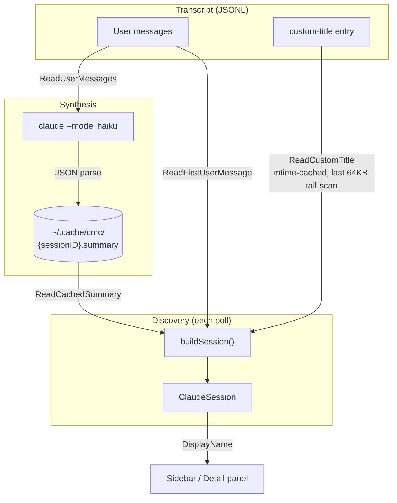

# Session Title Resolution

How a session gets its display name in the sidebar and detail panel.

## Priority Chain

```
CustomTitle → SynthesizedTitle → FirstMessage → "(New session)"
```

`ClaudeSession.DisplayName()` (`internal/claude/session.go`) returns the first non-empty value in that order.

| Field | Source | When populated |
|-------|--------|----------------|
| **CustomTitle** | Claude Code transcript (`custom-title` JSONL entry) | User runs `/rename` in Claude Code |
| **SynthesizedTitle** | AI synthesis cache (`~/.cache/cmc/{sessionID}.summary`) | Daemon auto-synthesizes on agent→user turn transition, or user presses `s` |
| **FirstMessage** | Transcript forward-scan for first `human` turn | Always available once user sends a message |

## Data Flow



## Synthesis

`claude.Summarize()` (`internal/claude/synthesize.go`) runs haiku with user messages and produces a `SessionSummary`:

```json
{
  "objective": "...",
  "status": "...",
  "problem_type": "bug|feature|refactoring|...",
  "headline": "<synthesized title>",
  "input_words": 123
}
```

The JSON key is `"headline"` (for AI prompt simplicity); the Go field is `SynthesizedTitle`.

### Title stability

When a previous `SynthesizedTitle` exists, the prompt instructs the LLM to keep it if the conversation goal hasn't changed. This prevents pointless rewording across re-synthesis cycles (e.g. "fix auth bug" → "debug auth token issue" → "resolve authentication error" all meaning the same thing).

### Fallback

If haiku omits the headline, `Summarize()` truncates the `objective` field to 60 chars.

### Cache freshness

Cached summary is reused (returned as `fromCache=true`) when the `.summary` file is newer than the transcript. Stale cache triggers a fresh AI call.

## Auto-synthesis

`daemon.autoSynthesize()` (`internal/daemon/daemon_synthesis.go`) fires when a session transitions from agent-turn → user-turn:

1. Skipped if `autoSynthesize` pref is `"false"`
2. Skipped if `CustomTitle` is already set (synthesized title wouldn't be displayed anyway)
3. Debounced: at most once per 30s per session
4. Does **not** inject `/rename` keystrokes — the title appears on the next poll cycle via `ReadCachedSummary`

## The `/rename` bootstrap

Manual synthesis (`s` key or `synthesize_all`) injects `/rename <title>` keystrokes into the tmux pane after fresh synthesis:

```
synthesis completes (fromCache=false)
  → tmux.SendKeys(paneID, "/rename "+title, "Enter")
    → Claude Code writes custom-title entry to transcript
      → next poll: ReadCustomTitle() returns it as CustomTitle
        → CustomTitle now takes priority over SynthesizedTitle in DisplayName()
```

This only works when the Claude Code session is idle at the prompt. Auto-synthesis intentionally skips this to avoid polluting the user's input buffer.

## Later Records

`LaterRecord` snapshots `SynthesizedTitle`, `CustomTitle`, and `FirstMessage` at later-mark time. Phantom sessions (dead pane, live Later record) display correctly using these stored values.

## Lua API

| Function | Returns |
|----------|---------|
| `summary(id)` | `{synthesized_title}` or `nil` |
| `synthesize(id)` | `{synthesized_title, from_cache}` |
| `synthesize_all()` | `[{pane_id, synthesized_title, from_cache}]` |

Session tables expose `synthesized_title`, `custom_title`, and `display_name` fields.
