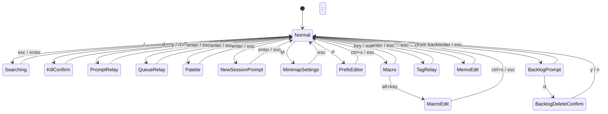
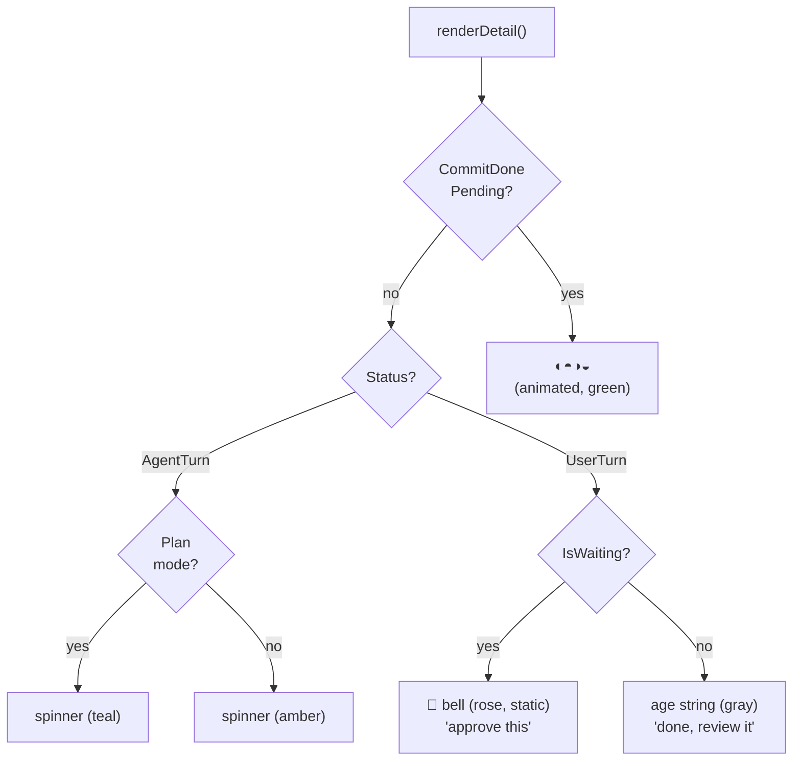

# UX Vocabulary & Patterns

Comprehensive glossary of UI components, interaction patterns, visual design, and domain terminology used throughout the spirit TUI.

## Layout Structure

### Top-Level Frame

The TUI fills the terminal. In normal mode it's wrapped in a bordered frame (`╭/╮` corners). In **fullscreen popup** mode (`CLAUDE_TUI_FULLSCREEN=1`) the top and side borders are removed for edge-to-edge rendering.

```mermaid
block-beta
    columns 1
    block:topbar["Usage Bar (top border doubles as fill gauge)"]
    end
    block:label["Label Line (usage stats | search bar)"]
    end
    block:content
        columns 2
        block:sidebar["Sidebar Panel<br/>(sessions, groups, backlog)"]
        end
        block:detail["Detail Panel<br/>(terminal preview, transcript,<br/>diff stats, memo, relay input)"]
        end
    end
    block:minimap["Optional: Docked Minimap"]
    end
    block:footer["Footer (keybinding hints | flash messages | chord hints)"]
    end
```

| Region | Description | Source |
|--------|-------------|--------|
| **Usage bar** | Top border row; doubles as a fill-gauge showing API usage percentage | `usagebar.go` |
| **Label line** | Row below top border; shows usage stats label or search input | `view.go:33-38` |
| **Sidebar panel** | Left column; scrollable list of sessions, project groups, backlog items | `sidebar.go` |
| **Detail panel** | Right column; terminal preview, transcript, diffs, memo, relay input | `detail.go` |
| **Footer** | Bottom row; context-sensitive keybinding hints, flash messages, chord hints | `view.go:41`, `styles.go:94` |
| **Content area** | Total height minus top border, label, footer (and bottom border when bordered) | `model.go:298-304` |

### Panel Sizing

- **`sidebarWidthPct`**: Percentage of total width for sidebar (default 30%, resizable with `alt+h/l`)
- **`innerWidth()`**: Usable content width = total width minus 2 side borders (or full width in fullscreen)
- Layout is recomputed on every `WindowSizeMsg` via `applyLayout()`

## Overlays

Floating panels composited on top of the base content layer. Each uses one of four positioning functions from `overlay.go`:

| Position Function | Anchoring |
|-------------------|-----------|
| `OverlayCentered` | Centered in content area |
| `OverlayBottomRight` | Bottom-right corner |
| `OverlayBottomLeft` | Bottom-left corner |
| `OverlayAt` | Specific (row, col) coordinate |

### Overlay Catalog

| Overlay | Trigger | Position | Border Color | Source |
|---------|---------|----------|--------------|--------|
| **Transcript** | `t` cycles overlay/docked/hidden | Centered or docked side-by-side | Border gray | `detail.go` |
| **Minimap** | `m` toggle, `M` cycle mode | Bottom-left (float) or docked at bottom | — | `minimap.go` |
| **Diff hunks** | `gd` chord | Centered | Green | `diff_overlay.go` |
| **Hooks** | `gh` chord | In detail panel | — | `detail.go:49` |
| **Raw transcript** | `gt` chord | In detail panel | — | `detail.go:57` |
| **Debug** | `D` toggle | Bottom-right (multi-panel) | Amber | `view.go:147-157` |
| **Help** | `?` toggle | Centered | Blue | `view.go:167-170` |
| **Spirit animal** | `gs` chord | Centered | Avatar color | `spirit.go` |
| **Command palette** | `;` | Centered | Blue | `palette.go` |
| **Macro palette** | `.` | Anchored at sidebar selection row | Amber | `view.go:181-189` |
| **Macro editor** | From macro palette | Centered | Amber | `view.go:191-194` |
| **Prompt editor** | `a` (new session) or backlog | Anchored at sidebar row | Green (session) / Cyan (backlog) | `view.go:206-219` |
| **Preferences editor** | `P` | Centered | Blue | `view.go:201-204` |
| **Message log** | `!` toggle | Bottom-right | — | `view.go:172-178` |

### Transient Notifications

| Type | Display | TTL | Source |
|------|---------|-----|--------|
| **Flash** | Footer bar replacement (full width) | Custom per message | `model.go:282-295` |
| **Toast** | Bottom-right floating box (when footer is occupied) | 8 seconds | `model.go:259-267` |

## App States (Interaction Modes)



Each state controls which key events are captured and how the footer renders. Defined in `model.go:34-50`.

| State | Description | Entry Key | Exit |
|-------|-------------|-----------|------|
| `StateNormal` | Default navigation | — | — |
| `StateSearching` | Search input in label line | `/` | `esc` clears, `enter` confirms |
| `StateKillConfirm` | Kill confirmation in footer | `d` | `y`/`n` |
| `StatePromptRelay` | Text input for sending to Claude | `>` | `enter` sends, `esc` cancels |
| `StateQueueRelay` | Text input for queuing a message | `<` | `enter` appends, `esc` cancels |
| `StatePalette` | Command palette open | `;` | `enter` executes, `esc` cancels |
| `StateNewSessionPrompt` | Prompt editor for new session | `a` | `enter` creates, `esc` cancels |
| `StateMinimapSettings` | Footer shows minimap mode/scale controls | `M` | `esc` |
| `StatePrefsEditor` | Preferences overlay | `P` | `ctrl+s` saves, `esc` cancels |
| `StateBacklogPrompt` | Backlog item create/edit | From backlog context | `enter` saves, `esc` cancels |
| `StateBacklogDeleteConfirm` | Backlog delete confirmation | From backlog | `y`/`n` |
| `StateMacro` | Macro palette, waiting for key | `.` | Single key selects, `esc` cancels |
| `StateMacroEdit` | Macro editor overlay | From macro palette | `ctrl+s` saves, `esc` cancels |
| `StateTagRelay` | Inline tag input in sidebar | `#` | `enter` applies, `esc` cancels |
| `StateMemoEdit` | Session note editor in detail panel | `n` | `esc` saves |

## Key Bindings

### Single-Key Bindings (Normal Mode)

Source: `internal/app/keymap.go`

#### Navigation
| Key | Action |
|-----|--------|
| `j` / `k` (or `↑` / `↓`) | Move cursor up/down in sidebar |
| `h` / `l` | Navigate to project level / session level (tree nav) |
| `G` | Jump to bottom of sidebar |
| `enter` | Switch tmux focus to selected pane |
| `/` | Open search bar |
| `ctrl+d` / `ctrl+u` | Half-page scroll in detail viewport |
| `ctrl+e` / `ctrl+y` | Single-line scroll |
| `ctrl+f` / `ctrl+b` | Full-page scroll |
| `ctrl+j` / `ctrl+k` | Jump to next/previous user message anchor |
| `ctrl+o` / `shift+tab` | Jump back in jump trail |
| `tab` | Jump forward in jump trail |
| `H` / `J` / `K` / `L` | Spatial navigation across tmux panes (minimap) |

#### Actions
| Key | Action |
|-----|--------|
| `>` | Open prompt relay (send message to Claude session) |
| `<` | Open queue relay (queue message for when session finishes) |
| `w` | Mark session as Later |
| `W` | Mark later + kill pane |
| `d` | Kill session + close pane (with confirmation) |
| `c` | Send `/commit` to session |
| `C` | Commit + done (commit, verify, then kill) |
| `s` | Synthesize selected session (AI summary) |
| `S` | Synthesize all sessions |
| `R` | Rename tmux window (Haiku-generated name) |
| `a` | New session (open prompt editor) |
| `r` | Refresh preview capture |
| `n` | Open session note (memo) editor |
| `#` | Open tag relay (inline tag input) |
| `.` | Open macro palette |

#### Toggles & UI
| Key | Action |
|-----|--------|
| `t` | Cycle transcript mode (overlay → docked → hidden) |
| `m` | Toggle minimap |
| `M` | Cycle minimap display mode |
| `o` | Toggle group-by-project mode |
| `z` | Fullscreen toggle |
| `alt+h` / `alt+l` | Shrink/grow sidebar panel |
| `alt+w` | Toggle Later section visibility |
| `alt+b` | Toggle Backlog section visibility |
| `;` | Open command palette |
| `P` | Open preferences editor |
| `!` | Toggle message log overlay |
| `?` | Toggle help overlay |
| `D` | Toggle debug overlay |
| `q` | Quit |
| `esc` | Dismiss/cancel current mode |

### Chord Bindings

Two-key sequences. The first key puts spirit into chord-pending state; available continuations are shown in the footer.

| Chord | Action |
|-------|--------|
| `ys` | Copy session ID to clipboard |
| `yc` | Capture current view to file |
| `gd` | Toggle diff hunks overlay |
| `gh` | Toggle hooks event overlay |
| `gt` | Toggle raw transcript (JSON) overlay |
| `gg` | Go to top of sidebar |
| `gs` | Show spirit animal ASCII art overlay |

### Relay Modes

Three typed-input modes, each with a distinct prompt character and color:

| Mode | Prompt | Color | Description |
|------|--------|-------|-------------|
| Prompt relay (`>`) | `❯` | Green | Send text directly to Claude session via tmux keys |
| Queue relay (`<`) | `❮` | Amber | Queue text for delivery when session becomes idle |
| Tag relay (`#`) | `#` | Muted gray | Set/toggle tags; renders inline in sidebar |

**Bang mode**: Within prompt relay, prefix text with `!` to trigger Claude's bash mode switch before sending the rest.

## Sidebar Sections & Grouping

### Status Groups (Default Layout)

Sessions are grouped by status, rendered in this order:

| Section | Color | Description |
|---------|-------|-------------|
| **WORKING** | Amber | Sessions where Claude is actively working (agent-turn) |
| **YOUR TURN** | Blue | Sessions waiting for user (user-turn, not marked later) |
| **LATER** | Purple | Later-marked sessions (collapsible with `alt+w`) |
| **BACKLOG** | Cyan | Idea/task items from `.spirit/backlog/` dirs (collapsible with `alt+b`) |

### Group-by-Project Layout

Toggled with `o`. Sessions grouped under **project header** rows (bold, muted color). Each project shows a subheader with session count.

### Selection Model

| Concept | Description | Source |
|---------|-------------|--------|
| **cursor** | Integer index into the filtered list | `sidebar.go:57` |
| **SelectionLevel** | `LevelSession` (on a session) or `LevelProject` (on a project header) | `sidebar.go:21-26` |
| **CursorRef** | Type-agnostic save/restore struct (`PaneID` or `BacklogID`); survives list mutations | `sidebar.go:240-266` |
| **deselected** | No valid selection (e.g., minimap focused on a non-Claude pane) | `sidebar.go:66` |
| **narrow** | Live fuzzy filter string applied during search mode | `sidebar.go:60` |

### Jump Trail (Vim-style Jumplist)

A capped list (100 entries) of visited PaneIDs, maintained across programmatic jumps (`gg`, `G`, spatial nav, minimap clicks). Navigated with `ctrl+o` (back) and `tab` (forward). Source: `model.go:204-205`, `model.go:600-660`.

Visual feedback:
- **Landing flash**: Brief highlight on the destination item
- **Ghost trail**: Brief highlight on the departure item

## Visual Design System

### Status Colors

All colors use `lipgloss.AdaptiveColor` for light/dark terminal support. Source: `styles.go:17-29`.

| Status/Context | Color Name | Dark Mode Hex | Usage |
|----------------|-----------|---------------|-------|
| Working / agent-turn | `ColorWorking` | `#f59e0b` (amber) | Spinner, working items, macro palette |
| Done / user-turn | `ColorDone` | `#60a5fa` (blue) | Done items, commit done |
| Later / deferred | `ColorLater` | `#a78bfa` (purple) | Later records |
| Plan mode | `ColorPlan` | `#48968c` (teal) | Plan permission mode spinner |
| Waiting for user | `ColorWaiting` | `#f472b6` (rose) | Bell icon, permission/elicitation |
| Post-tool | `ColorPostTool` | `#22d3ee` (cyan) | PostToolUse hook state |
| Backlog | `ColorBacklog` | `#22d3ee` (cyan) | Backlog section, prompt editor border |
| Macro | `ColorMacro` | `#f59e0b` (amber) | Macro palette/editor |
| Note | `ColorNote` | `#facc15` (yellow) | Session memo indicator |
| Overlap | `ColorOverlap` | `#6b7280` (gray) | File overlap warning |
| Accent | `ColorAccent` | `#60a5fa` (blue) | Titles, selected items, search |
| Muted | `ColorMuted` | `#9ca3af` (gray) | Metadata, subtitles, disabled |
| Border | `ColorBorder` | `#4b5563` (gray) | Panel borders, separators |
| Selection bg | `ColorSelectionBg` | `#1e2235` | Selected row background |

### Diff Colors

| Style | Color | Usage |
|-------|-------|-------|
| `DiffAddedStyle` | Green | `+N` stats |
| `DiffDelBg` / `DiffAddBg` | Dim red/green background | Full diff line highlight |
| `DiffDelSymbol` / `DiffAddSymbol` | Bright red/green | `-` / `+` prefix characters |
| `DiffModSymbol` | Amber | `~` (modified) prefix |
| `DiffInlineDelBg` / `DiffInlineAddBg` | Brighter char-level bg | Inline character-level diff emphasis |

### Icons (Nerd Font)

All icons use Nerd Font codepoints. No emoji anywhere. Source: `internal/ui/icons.go`.

| Icon | Glyph | Meaning |
|------|-------|---------|
| `IconBolt` | `` (U+F0E7) | Agent-turn (working) |
| `IconFlag` | `` (U+F024) | User-turn / needs attention |
| `IconLater` | `` (U+F02E) | Later/deferred Later record |
| `IconGitBranch` | `` (U+F418) | Git branch |
| `IconClock` | `` (U+F252) | Clock / age |
| `IconFolder` | `` (U+F07B) | Folder / project |
| `IconFile` | `` (U+F15B) | File (diff file count) |
| `IconQuote` | `` (U+F10D) | User message subtitle |
| `IconGitCommit` | `` (U+E729) | Git commit |
| `IconInput` | `` (U+F11C) | Last user message subtitle |
| `IconHeadline` | `` (U+F0EB) | Headline match context |
| `IconQueue` | `` (U+F017) | Queued message pending delivery |
| `IconBullet` | `` (U+F444) | Transcript message bullet |
| `IconID` | `󎻾` (U+F0EFE) | Session ID indicator |
| `IconWaiting` | `` (U+F0F3) | Waiting for user input (bell) |
| `IconCompact` | `` (U+F01E) | Context compaction event |
| `IconNewFile` | `` (U+F067) | New file (Write only, in diff) |
| `IconModified` | `` (U+F040) | Modified file (has Edit, in diff) |
| `IconSkill` | `` (U+F0AD) | Skill invocation badge |
| `IconBacklog` | `` (U+F0EB) | Backlog item |
| `IconNote` | `` (U+F249) | Session memo/note |
| `IconOverlap` | `` (U+F071) | File overlap between sessions |
| `IconWorktree` | `` (U+F126) | Worktree session (code fork) |
| `IconPillLeft/Right` | Powerline glyphs | Usage bar weekly fill pill caps |
| `IconRadioOff/On` | `○` / `◉` | Radio toggle glyphs |
| `IconCheckOff/On` | `☐` / `☑` | Checkbox toggle glyphs |

### Avatar System

Each Claude session is assigned a unique visual identity composed of an animal glyph and a color. Source: `avatar.go`.

- **23 animals**: Cat, Dog, Fish, Bird, etc. — assigned by `AvatarAnimalIdx`
- **8 colors**: Rose, orange, yellow, green, cyan, indigo, pink, teal — assigned by `AvatarColorIdx`
- **Mnemonic name**: Human-readable unique name like "Ember Cat" (adjective + animal)
- **Avatar badge**: Colored pill showing the mnemonic name
- **AvatarFillBg**: Subtle tinted background for the selected row
- **Spirit animal**: Full ASCII art rendering, shown via `gs` chord

## Session Display

### Display Name Priority

`ClaudeSession.DisplayName()` resolves in this order:
1. `CustomTitle` — set by user via `/rename` in Claude Code (highest priority)
2. `Headline` — AI-synthesized one-liner from cached summary
3. `FirstMessage` — first user message in transcript
4. `"(New session)"` — fallback when nothing else is available

### Detail Column Rendering

The right side of each sidebar row shows session status:



### Badges Line

Below the session name, contextual badges appear:

| Condition | Badge | Color |
|-----------|-------|-------|
| `LastActionCommit && UserTurn` | `✓ committed` | Green |
| `StopReason != "" && UserTurn` | Reason text | Blue |
| `CompactCount > 0` | `↻N` | Gray |
| Marked later | `🔖 later` | Purple |
| `HasOverlap` | `⚠ overlap` | Gray |
| `SkillName != ""` | Skill name badge | Wrench icon |

## Minimap

A spatial rendering of tmux pane layout for the current tmux session, showing pane boundaries, status colors, and avatar glyphs. Source: `minimap.go`.

### Display Modes

Cycled with `M` key:

| Mode | Behavior |
|------|----------|
| `auto` | Docked in fullscreen, overlay in normal mode |
| `docked` | Always docked at bottom (reduces content height) |
| `float` | Always overlaid (bottom-left) |
| `smart` | Docked when minimap is wider than sidebar panel |

### Controls (StateMinimapSettings)

| Control | Action |
|---------|--------|
| `M` | Cycle through display modes |
| `+` / `-` | Scale minimap height (persisted) |
| `c` | Toggle collapse of single-pane windows |
| `esc` | Exit minimap settings |

## Domain Terminology

| Term | Definition |
|------|------------|
| **agent-turn** | Session status: Claude is actively working |
| **user-turn** | Session status: Claude stopped, waiting for user |
| **later** | Verb/noun: Later record a session for revisiting |
| **phantom session** | Session from a Later record with no live tmux pane (`IsPhantom=true`) |
| **worktree session** | Session running in a Claude Code git worktree |
| **synthesize / synthesis** | AI-generated summary producing `Headline` + `ProblemType` |
| **relay** | Sending text from spirit to a Claude session via tmux keystrokes |
| **bang mode** | `!` prefix in relay triggers Claude's bash mode switch |
| **commit + done** | Compound action: trigger `/commit`, verify completion, then kill pane |
| **kill** | Terminate Claude process and close tmux pane |
| **narrow** | Live fuzzy filter string (search mode) |
| **flash** | Transient footer message (info or error) |
| **toast** | Bottom-right notification overlay (used when footer is occupied) |
| **chord** | Two-key sequence (e.g., `ys`, `gd`) with pending state shown in footer |
| **spatial navigation** | Moving between tmux panes using minimap coordinates (H/J/K/L) |
| **docked** | Panel mode sharing the screen layout (vs. floating overlay) |
| **group mode** | Sidebar layout grouping sessions by project header |
| **original pane** | The tmux pane active when spirit launched; restored on quit/esc |
| **macro** | User-defined or built-in text snippet; invoked via macro palette |
| **backlog** | Idea/task item stored in `.spirit/backlog/`; shown in sidebar |
| **memo / note** | Freeform sticky note per session |
| **tags** | User-defined labels per session |
| **queue** | Messages waiting to be sent when session becomes idle |
| **overlap** | Two or more active sessions editing the same file simultaneously |
