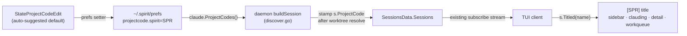

# Project Code — a 3-char project tag prefixed to session titles

Associate each project with an optional 3-character **project code** (e.g. `SPR`, `LEX`, `EIR`) and render it as a bracketed prefix — `[SPR] intro explosion recap` — in front of the session title across every spirit-rendered surface. Opt-in per project: a session shows a prefix only once its project has a code assigned.

## Motivation

The sidebar already groups sessions under project headers, but once you're scanning a flat surface — the all-quiet/clauding dashboard, the work queue, the detail header, a search result list — the project is invisible. With several repos in flight (spirit, lexicon, eir, a couple of aitomatic worktrees), two sessions named "fix the worktree picker" are indistinguishable until you trace them back to their group. A terse, stable, color-free 3-letter tag in front of the title makes the owning project legible everywhere a title appears, at a glance, without widening the layout meaningfully.

The grain is deliberately the **project**, not the session: codes are assigned once per repo and inherited by every session (and every worktree) under it. `«project»` is already the natural key — sessions carry it, the sidebar already groups on it, and worktrees already resolve to their repo-root basename, so worktrees of one repo correctly share its code for free.

## Vocabulary (to crystallize)

This repo has no cold layer yet (`lexicon/` holds only `Backlog.md`). These terms are introduced by this work and should become atoms on a future `lexicon:bootstrap`/`crystallize`:

- **`«project»`** — the basename of a session's working directory, worktree-root-resolved. Already a field: `internal/claude/session.go::ClaudeSession.Project` ("basename of cwd"), assigned in `internal/claude/discover.go` `buildSession` (`s.Project = filepath.Base(...)`, with the worktree branch substituting `WorktreeRootProjectPath`'s basename).
- **`«project-code»`** — an optional 3-char uppercase tag associated with a `«project»`, shown as a `[CODE]` prefix on titles.
- **`«display-name»`** — the resolved session title: `CustomTitle → SynthesizedTitle → FirstMessage → ""`, via `internal/claude/session.go::ClaudeSession.DisplayName`. Each render site substitutes its own `(New session)` placeholder when this is empty.

## Decisions

### Decision 1 — Key the code on `«project»` (dir basename), not CWD or git remote

The mapping is `project-basename → code`. This is the same string sessions already group by, so no new identity concept enters the system, and worktrees of a repo share the code automatically (they already collapse to the repo-root basename in `discover.go`).

**Rejected — full CWD path as key:** too long to hand-edit, and worktrees of the same repo would land on *different* keys and need the code re-assigned per worktree. We want the opposite: one code per repo, inherited.

**Rejected — git remote URL as key:** not always present (local-only repos), and the daemon doesn't currently track remotes — it would add a discovery dependency for no gain over the basename.

**Known limitation (accepted for v1):** two distinct repos with the same basename (e.g. two `app/` dirs) collide onto one code. Rare in practice given how `«project»` is already used for grouping; revisit only if it bites. See Risks.

### Decision 2 — Store the mapping as namespaced keys in `~/.spirit/prefs`

Persist each assignment as a line `projectcode.<project>=<CODE>` in the existing prefs file, reusing `internal/claude/prefs.go` (daemon/read side) and `internal/app/prefs.go` (client/write side). Add thin accessors — `claude.ProjectCodes() map[string]string` (scan `LoadPrefs`, strip the `projectcode.` prefix) and a setter on the app/prefs side (`savePrefString`/`savePrefs`) — rather than open-coding the prefix at call sites.

The namespaced flat key fits the line-based `key=value` parser (`strings.Cut(line, "=")`) cleanly: the cut is on the first `=`, the prefix delimiter is `.`, and project basenames don't contain `=`. Assigning an empty code deletes the key (clears the assignment).

**Rejected — a JSON blob value** (`project_codes={"spirit":"SPR",...}`): fragile inside a line-oriented parser, and a stray newline or `=` in the blob would corrupt the whole prefs read. The flat namespaced form degrades gracefully — one bad line is one lost mapping.

**Rejected — a per-repo `.claude/projectcode` file:** no existing per-directory config infra, it pollutes tracked repos, and it wouldn't uniformly cover phantom/Later sessions that have no live checkout. Prefs is already daemon-loaded and the single source for this kind of cross-session setting.

### Decision 3 — The daemon stamps `ProjectCode` onto each session; the code rides the existing payload

Add `ProjectCode string` to `internal/claude/session.go::ClaudeSession`. The daemon populates it in `buildSession` (right after `s.Project` is finalized — *after* the worktree branch, so worktrees inherit correctly) by looking up `claude.ProjectCodes()`. It then travels to every client inside the existing `internal/daemon/protocol.go::SessionsData.Sessions` payload — **no protocol change, no new RPC.**

This puts the single lookup where project identity is already resolved (daemon-side, worktree-aware) and keeps every render site dumb: a site reads `s.ProjectCode`, it never consults the prefs map. The map is loaded once per poll, not per session render.

**Rejected — ship a `map[string]string` to the client and look up `s.Project` at each render site:** duplicates the worktree-resolution logic client-side, needs a new `SessionsData` field, and forces every render site to carry the map. Stamping the resolved code onto the session is strictly less plumbing.

### Decision 4 — One composition helper, swapped in at each render site; never mutate `DisplayName`

Add a method `func (s ClaudeSession) Titled(resolvedName string) string` that returns `"[" + s.ProjectCode + "] " + resolvedName` when `ProjectCode != "" && resolvedName != ""`, else `resolvedName` unchanged. Render sites resolve their name (including their own `(New session)` placeholder) and then wrap it once: `name = s.Titled(name)`. The bracket format `[CODE] ` lives in exactly one place.

It must take the *resolved* name, not call `DisplayName()` internally, because the placeholder is applied downstream of `DisplayName()` at each site and differs per site — and a new session in an assigned project should still read `[SPR] (New session)`.

The render sites (each currently `name := s.DisplayName()` or equivalent):

| Surface | Site | Note |
|---|---|---|
| Sidebar list | `internal/ui/session_item.go` `titleLayout` (~`session_item.go:26`) | `isNew`/empty path returns early — apply the prefix where the placeholder is rendered, so new sessions in assigned projects still tag |
| All-quiet / clauding | `internal/ui/sidebar.go` `claudingEntry` (~`sidebar.go:223`) | placeholder already resolved here → `name = s.Titled(name)` |
| Detail header | `internal/ui/detail_view.go` (~`detail_view.go:41`) | |
| Work queue card | `internal/ui/workqueue.go` (~`workqueue.go:348`) | |

**Rejected — make `DisplayName()` itself return the prefixed string:** `DisplayName` also feeds the AI window-name generator (`internal/claude/rename.go` `GenerateAllWindowNames`) and title-drift logic; prefixing there would poison non-UI consumers and risk double-prefixing. The prefix is a *rendering* concern, isolated to render sites.

**Rejected — inline the `[CODE] ` format at each site:** four copies of the same format string drift apart. One helper, one format.

> **Revised 2026-06-17:** the prefix is **two-tone colored** (brackets in `[[term/color/faint]]` `ColorFaint` `#4b5563`, the code in `ColorMuted` `#9ca3af` — brackets fainter than the code), which forced the helper from the `claude` package into the `ui` layer (`internal/ui/project_code.go` `renderProjectCode` / `renderProjectCodeBg` / `projectCodeWidth`). The colored prefix is rendered as a **separate styled segment prepended outside the title's own styling**, never folded into the title string — because every title render path is ANSI-hostile: `highlightMatch` fuzzy-matches over raw runes, lipgloss `bg.Render` and `ItemDetailStyle.Render` wrap (and embedded SGR resets would break their background/foreground), and the clauding dashboard runs the name through a per-rune `shimmer`. So `claude.Titled` was removed; each site keeps a **plain** name through width-math/highlight/truncation and reserves `projectCodeWidth(s)` columns for the prefix. The selected-row variant (`renderProjectCodeBg`) paints the selection background behind the prefix; the clauding entry carries the prefix as a separate `CodePrefix` field so it stays static ahead of the shimmering title.

### Decision 5 — Assignment is a small per-project editor, prefilled with an auto-suggested code

Reuse the existing per-session modal-edit pattern (cf. `StateNoteEdit`, tag editing) with a new `StateProjectCodeEdit`: from a focused session, a keybinding opens a single-field input scoped to that session's `«project»`, **prefilled with an auto-suggested code**. The user accepts or edits; the input accepts up to 3 chars, uppercased, alphanumeric; submitting blank clears the assignment. On submit the client writes `projectcode.<project>` via the prefs setter; the daemon picks it up on the next poll and re-stamps sessions.

**Auto-suggestion algorithm** (`claude.SuggestProjectCode(project string) string`): split the basename on word boundaries (`-`, `_`, space, `.`, and camelCase transitions); if ≥2 tokens, take the first letter of the first three tokens (`honeywell-forge-cognition-workspace` → `HFC`, `DanaAgent` → `DA`); else take the first three letters of the single token (`spirit` → `SPI`, `lexicon` → `LEX`); uppercase, truncate to ≤3. It only *prefills* the editor — it never auto-assigns (Decision 6).

**Rejected — prefs-file hand-editing only:** not discoverable; the whole point of "auto-suggest + editable" is a zero-thought default with an in-app override.

**Rejected — auto-only with no override:** collisions (two repos → same suggested 3 letters) would be unresolvable; the user explicitly wants to disambiguate.

The assignment keybinding must avoid `ctrl+a` (Huy's tmux prefix — see spirit memory `user_tmux_prefix`). Exact key TBD at implementation; it belongs alongside the other per-session edit actions.

### Decision 6 — Opt-in: a prefix shows only when a code is assigned

A session renders a prefix iff its project has a non-empty assigned code. Unassigned projects render exactly as today. Auto-suggestion fills the *editor default* but does not assign — nothing appears until the user confirms.

**Rejected — always-on auto codes for every project:** noise for the common single-project session, and it would force a code onto throwaway/scratch dirs. Opt-in keeps the surface quiet until the user opts a repo in.

## Data flow

## Phasing

| Phase | Deliverable | Gate |
|---|---|---|
| 1 — Storage + lookup | `ProjectCode` field; `claude.ProjectCodes()`, `claude.SuggestProjectCode()`, prefs setter; daemon stamps `s.ProjectCode` in `buildSession` | Hand-set a `projectcode.spirit=SPR` line → daemon-served sessions carry `ProjectCode: "SPR"` (verify via `spirit eval`) |
| 2 — Render | `ClaudeSession.Titled`; swap it into the four render sites | `spirit capture` shows `[SPR]` prefixes in sidebar, clauding, detail, work queue; unassigned projects unchanged; `[SPR] (New session)` for titleless sessions in an assigned project |
| 3 — Assignment UX | `StateProjectCodeEdit` modal + keybinding, prefilled with the suggestion; blank clears | Open editor on a session → suggested code prefilled → edit/accept → prefix appears next poll; blank → prefix gone |

## Risks / open questions

- **Basename collisions (Decision 1):** distinct repos sharing a basename share a code. Accepted for v1; if it bites, the fix is to key on a longer disambiguator (parent/basename) without changing the render path.
- **`(New session)` prefixing:** decided *yes* — the project is known from CWD before any title exists, so `[SPR] (New session)` is correct and useful. Confirm it reads well in the narrow sidebar column (width math in `titleLayout` must account for the extra `[CODE] ` — 6 cols — mirroring `renderItem`'s prefix accounting).
- **tmux window names — out of scope.** The tmux window title flows through Claude Code's `/rename` and the Haiku `GenerateAllWindowNames` pipeline (`internal/claude/rename.go`, `internal/daemon/server_synthesis.go`), a Claude-owned surface distinct from spirit's own rendering. Prefixing it is a plausible follow-up but is **not** part of this spec — "the UIs" here means spirit-rendered surfaces.
- **Keybinding choice:** must not collide with `ctrl+a` or existing per-session edit keys; settle during Phase 3.
- **Code charset/length:** fixed at ≤3 uppercase alphanumerics. Whether to allow exactly-3 vs ≤3 (e.g. a 2-char `UI`) is left open — leaning ≤3 for flexibility.

## Related

- `lexicon/Backlog.md` — "tag-based color for the session" overlaps in spirit: a future iteration could color the `[CODE]` chip per project, unifying with that idea. Kept color-free here per the chosen render style (bracketed plain, survives ANSI-stripped `spirit capture`).
